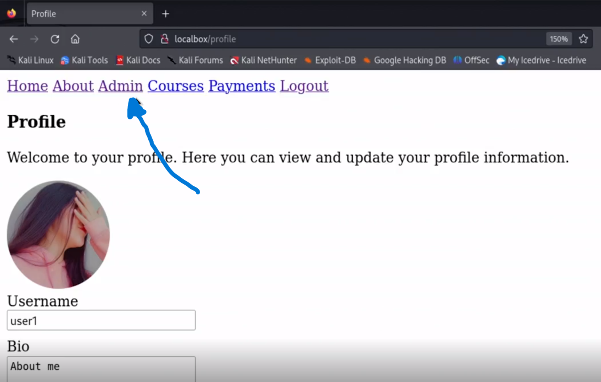
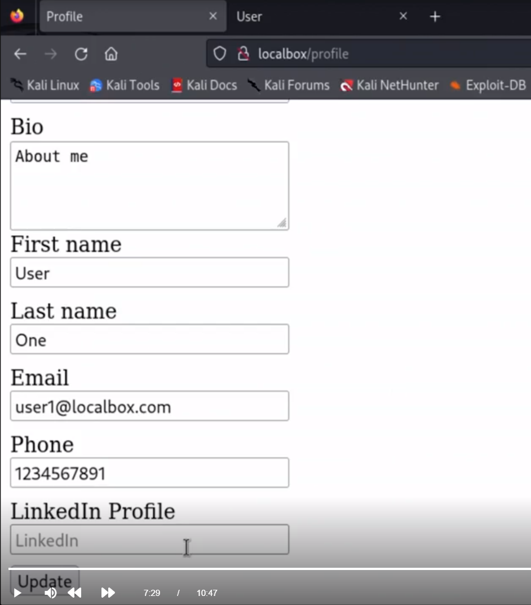
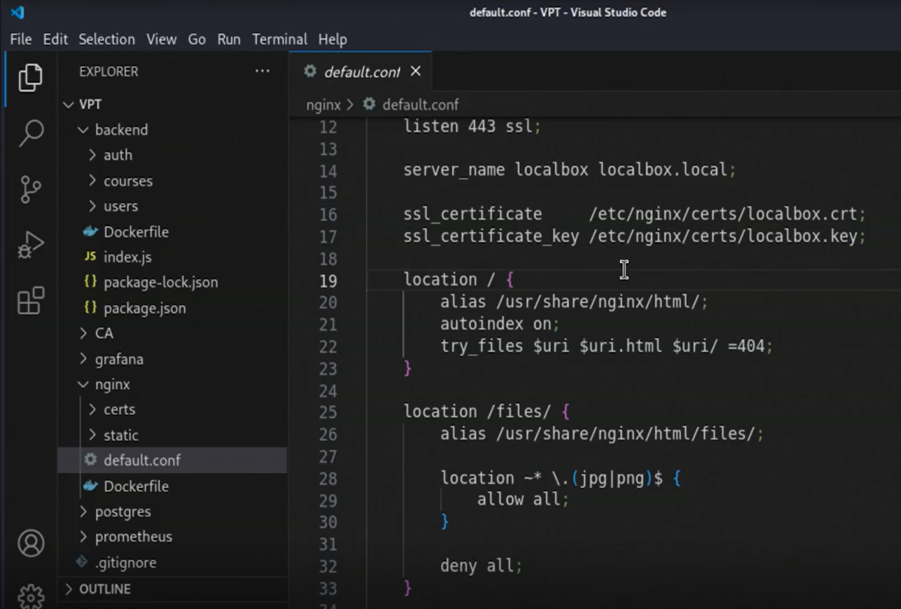
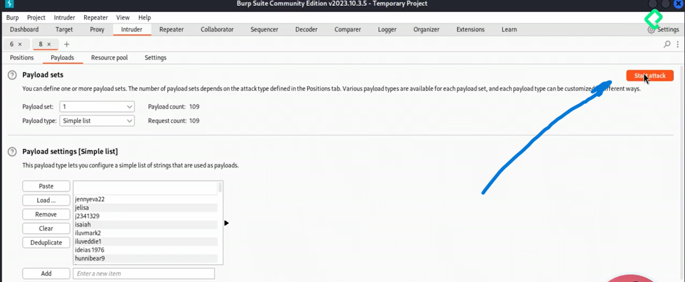

# Listado de capitulos (because, the document is laaarge)
- [¿Qué es OWASP Top 10?](#WhatIsOwasp10)
- [¿Cómo utilizar OWASP Top 10?](#HowToUseOwasp10)
- [Broken Access Control - A01](#A01)
- - [PRÁCTICA BROKEN ACCESS CONTROL](#praA01)
- [Cryptographic Failures - A02](#A02)
- - [PRÁCTICA Cryptographic Failures](#praA02)
- [Injection - A03](#A03)
- - [PRÁCTICA INJECTION](#praA03)
- [Insecure Design - A04](#A04)
- - [PRÁCTICA INSECURE DESIGN](#praA04)
- [Security Misconfiguration - A05](#A05)
- - [PRÁCTICA SECURITY MISCONFIGURATION](#praA05)
- [Vulnerable and Outdated Components - A06](#A06)
- - [PRÁCTICA VULNERABLE AND OUTDATED COMPONENTES - A06](#praA06)
- [Identification and Authentication Failures - A07](#A07)
- - [PRÁCTICA IDENTIFICATION AND AUTHENTICATION FAILURES - A07](#praA07)
- [Software and Data Integrity Failures - A08](#A08)
- - [PRÁCTICA SOFTWARE AND DATA INTEGRITY FAILURES - A08](#praA08)


<h1 id="#WhatIsOwasp10">¿Qué es OWASP Top 10?</h1>

OWASP, que significa Open Web Application Security Project, es una organización sin fines de lucro que trabaja para mejorar la seguridad
del software a través de la identificación y la divulgación de las fallas de seguridad más críticas.
OWASP ha generado múltiples propyectos de importancia como TOP 10 que recolecta los 10 riesgos más imporantes que los Devs deben considerar para mitigar vulnerariblidades.
Este listado es ampliamente reconocido y respetado en la industria de la ciberseguridad y sirve como un punto de partida para las organizaciones que buscan mitigar
los riesgos de seguridad en sus aplicaciones web.

El OWASP Top 10 se actualiza periódicamente para reflejar la evolución del paisaje de amenazas y las prácticas de seguridad.
Aunque los elementos específicos de la lista pueden cambiar con cada actualización, típicamente incluyen vulnerabilidades
como inyección SQL, cross-site scripting (XSS), exposición de datos sensibles, y configuraciones incorrectas de seguridad, entre otros.
Cada elemento de la lista incluye una descripción de la vulnerabilidad, ejemplos de cómo puede ser explotada, y recomendaciones para mitigar o prevenir el riesgo.

> OWASP Top 10 es el primer paso hacia desarrollo seguro de código. Top 10 acompaña en todo el ciclo de desarrollo de Software y se puede contribuir y participar en la comunidad OWASP.

## Las 3 variables importantes (o insumos) en OWASP T10 son:
1. [Common Weakness Enumeration](https://cwe.mitre.org/): un listado de fallas en software y hardware mantenidos por la comunidad
2. [Common Vulnerabilities and Exposures](https://www.cve.org/): Repositorio de vulnerabilidades asociados a productos, aplicaciones o activos de información
3. [National Vulnerability Database](https://nvd.nist.gov/): Repositorio de vulnerabilidades gestionado por el Gobierno de Estados Unidos

## Orden de riesgos
Para definir el orden de los riesgos en el proyecto TOP 10 de OWASP se toman en consideración las 
siguientes variables: 
- Porcentaje de aplicaciones probadas a determinado registro CWE
- Porcentaje de aplicaciones vulnerables para el mismo registro CWE
- Número de aplicaciones vulnerables asociadas al porcentaje anterior
- Número de registros CWE mapeados hacia la categoría
- Número de vulnerabilidades (O CVE's) debidamente sincronizado con la BD de vulnerabilidades del gobierno de los Estados Unidos

<h1 id="HowToUseOwasp10">¿Cómo utilizar OWASP Top 10?</h1>
# [2] ¿Cómo utilizar OWASP Top 10?

La utilización del OWASP Top 10 como una herramienta para mejorar la seguridad de las aplicaciones web implica varias estrategias y prácticas.

- Una manera es crear programas de aseguramiento de aplicaciones en dónde debes incluir metas alcanzables, el ciclo de vida del desarrollo de software seguro y
finalmente, un nivel de madurez de la aplicación en dónde podemos apoyarnos de [OWASP SAMM](https://owaspsamm.org/).
> OWASP SAMM Resume los requerimientos de seguridad en funciones de negocio: Govierno, Diseño, Implementación, Verificación y Operaciones.

- También podemos usar OWASP Top 10 para crear educación continua en los equipos. Para esto podemos usar proyectos como [OWASP ASVS](https://owasp.org/www-project-application-security-verification-standard/)
  (Application Security Verification Standard, por sus siglas en inglés).
> OWASP ASVS Reune un gran listado de requerimientos de seguridad debidamente agrupados, codificados y con un código CWE asociado. 

  
A continuación, se describe un enfoque estructurado sobre cómo las organizaciones y los desarrolladores pueden hacer uso del OWASP Top 10 para fortalecer la seguridad de sus aplicaciones:

## 1. Educación y Concienciación

- **Capacitación del equipo de desarrollo:** Organizar sesiones de capacitación y talleres para los equipos de desarrollo y seguridad
   sobre las vulnerabilidades listadas en el OWASP Top 10, incluyendo sus implicaciones y cómo pueden ser explotadas.
- **Integración en el proceso de diseño:** Incluir la seguridad como un componente fundamental en las fases iniciales del diseño de aplicaciones web, utilizando el OWASP Top 10 como una guía para discutir posibles riesgos de seguridad.

## 2. Integración en el Ciclo de Desarrollo del Software

- **Revisión de código:** Implementar revisiones de código regulares que se centren específicamente en identificar patrones de código que puedan conducir a las vulnerabilidades listadas en el OWASP Top 10.
- **Pruebas de seguridad:** Utilizar herramientas automatizadas de pruebas de seguridad (como escáneres de vulnerabilidades y herramientas de análisis de código estático) que puedan identificar
   problemas relacionados con el OWASP Top 10 en las aplicaciones.

## 3. Mejora Continua

- **Remediación de vulnerabilidades:** Una vez identificadas las vulnerabilidades, es crucial priorizar y remediarlas de manera oportuna, basándose en el nivel de riesgo que cada una representa.
- **Actualización y mantenimiento:** Mantenerse al día con las últimas versiones del OWASP Top 10 y actualizar las prácticas de seguridad de la organización en consecuencia.

## 4. Políticas de Seguridad y Cumplimiento

- **Desarrollo de políticas de seguridad:** Desarrollar y mantener políticas de seguridad que incorporen los principios del OWASP Top 10, asegurando que todos los desarrollos cumplan con un estándar mínimo de seguridad.
- **Auditorías de seguridad:** Realizar auditorías de seguridad periódicas para evaluar la conformidad con el OWASP Top 10 y otras normativas de seguridad relevantes.

## 5. Adopción de Herramientas y Prácticas Recomendadas
- **Utilizar marcos de trabajo y bibliotecas seguras:** Optar por marcos de trabajo y bibliotecas que promuevan prácticas de desarrollo seguro y que estén activamente mantenidos.
- **Implementación de controles de seguridad:** Aplicar controles de seguridad específicos recomendados por OWASP para mitigar las vulnerabilidades, como el uso de Content Security Policy (CSP) para prevenir XSS,
 o la implementación de controles de acceso adecuados para prevenir la exposición de datos sensibles.

## Herramientas de práctica 
- [Proyecto Juice SHOP de OWASP](https://owasp.org/www-project-juice-shop/): Página con varios herrores de desarrollo para concientizar a los desarrolladores.
## Herramientas de laboratorio 
- [Página de pruebas para el curso](https://github.com/platzi/curso-owasp-top-10)
> Ahí encontraremos todo lo necesario en cuanto a herramientas necesarias para llevar a cabo el curso.

En lo personal me he montado Kali Linux para ahorrarme la instalación de algunas herramientas como: bupsuite o dirbuster. 
El tutorial que he seguido lo puedes ver aquí: [Como Instalar y Descargar Kali Linux 2024.1 en VirtualBox [Windows 10] - Desde Cero!](https://www.youtube.com/watch?v=iGmACGL3nos&ab_channel=ContandoBits)

--- 
<h1 id="A01">Broken Access Control [A01]</h1>

> A partir de aquí, comienzan las pruebas usando el laboratorio.
> La lista de las 10 vulnerabiliades la puedes ver en: [OWASP TOP TEN](https://owasp.org/www-project-top-ten/)

Se refiere a una categoría de vulnerabilidades de seguridad en aplicaciones web donde las restricciones sobre
lo que los usuarios autenticados están autorizados a hacer no se implementan o se implementan incorrectamente. 
Esta vulnerabilidad ocurre cuando un usuario puede realizar acciones fuera de sus permisos previstos, como acceder a datos o realizar operaciones que deberían estar restringidas.

## Ejemplos Comunes de Broken Access Control
- **Bypass de restricciones de acceso:** Un usuario sin privilegios accede a funciones o datos
  reservados para usuarios con mayores privilegios, como acceder a perfiles de usuario, datos financieros, o realizar acciones administrativas sin las debidas autorizaciones.
- **Modificación de URL o ID de sesión:** Manipular URL o identificadores de sesión para acceder a información o realizar acciones que no deberían estar disponibles
   para el usuario autenticado.
- **Elevación de privilegios:** Un usuario con privilegios bajos manipula la aplicación para otorgarse privilegios más altos.

### Impacto

El impacto de Broken Access Control puede ser significativo y variado, dependiendo de la naturaleza de la aplicación y
los datos o funciones expuestas indebidamente. Puede conducir a la divulgación no autorizada de información sensible,
modificación de datos, realización de transacciones no autorizadas, e incluso comprometer completamente la seguridad de la aplicación web.

### Mitigación

Para mitigar las vulnerabilidades de Broken Access Control, se recomienda adoptar un enfoque de seguridad en capas que incluya:
- **Principio de menor privilegio:** Asegurarse de que los usuarios tengan solo los permisos necesarios para realizar sus tareas.
- **Autenticación y autorización robustas:** Implementar controles de acceso fuertes y asegurarse de que se verifiquen de manera consistente a lo largo de la aplicación.
- **Controles de acceso a nivel de aplicación:** Utilizar controles de acceso en el servidor, no solo en el cliente, para asegurar que los controles no puedan ser fácilmente evadidos.
- **Auditorías y registros:** Mantener registros detallados de las actividades de acceso para permitir la auditoría y la detección de accesos no autorizados o anomalías.
- **Pruebas de seguridad regulares:** Realizar pruebas de penetración y revisiones de código para identificar y remediar las vulnerabilidades de control de acceso roto antes de que puedan ser explotadas.
  Aplica correctamente rate limits para que no sea posible hacer más de cierta cantidad de peticiones por minuto. 

<h1 id="praA01">PRÁCTICA BROKEN ACCESS CONTROL</h1>


NOTA: Antes de comenzar. Configura la herramienta de Burpsuite, para escuchar las peticiones 

Como primer paso, entramos a la plataforma: `localbox/` y veremos algo cómo: 

Procedemos a iniciar sesión con el usuario de administrador. 
> user: admin - password: admin
> NOTA: Los usuarios utilizados aquí se encuentran en la página del proyecto.


Una vez que iniciamos sesión como administrador podemos observar que hay una opción (Admin) a la que
solo se tiene acceso como administrador. 


Si vamos a la opción de Admin, podemos observar que nos lista los usarios de la plataforma. 


Cerramos la sesión de administrador y ahora iniciamos sesión como un usuario normal.
> user: user1 - password: 1234 


Al iniciar sesión como un usuario normal podemos observar que la opción de "Admin"
no esta disponible para este usuario. 


Si hacemos una petición al endpoint: `localbox/api/users` que es el endpoint que
se utiliza en la opción de "Admin" para listar los usuarios.
> Lo anterior lo podemos comprobar yendo a la opción "Admin" e inspeccionando la página
> a la hora de entrar a esa opción. Se hace una petición GET a ese endpoint.

Podemos observar que nos arroja el mensaje de que no estamos autorizados.  


Si vamos al historial de Burpsuite y revisamos la petición que se realizo cuando iniciamos
sesión como un usuario normal podemos ver el body utilizado pero, si observamos la respuesta,
vemos una cookie cuyo valor se ve interesante. Seleccionamos el valor para una operación posterior.


El valor que hemos notado anteriormente en la cookie, parece ser un cifrado en base 64, así que utilizando
una herramienta online, procedemos a decodificarlo. Observamos algo muuuuy llamativo.
Un diccionario con el id del usuario pero también con su rol. 


Si tomamos, ese diccionario, pero en lugar de conservar el rol "user" lo cambiamos por "admin"
y codificamos nuevamente, en base 64. Observamos que tenemos un valor similar al de la
cookie anterior. Guardamos dicho valor para su posterior uso. 


Regresamos a Burpsuite y buscamos la petición al endpoint `localbox/api/users` que anteriormente
nos había retornado que no estabamos autorizados. Observamos que dicha petición manda una cookie similar a la que hemos codificado.
Marcamos dicha petición para repetirla. 


Con el nuevo valor de cookie codificado anteriormente, realizamos un cambio de cookie en dicha petición.
Y la volvemos a enviar. Observamos que ahora la respuesta no es que no estamos autorizados sino que ahora
¡nos retorna toda la lista de usuarios! Es decir, tenemos privilegios de administrador.


## Hardening
> En informática, el hardening o endurecimiento es el proceso de asegurar un sistema reduciendo sus vulnerabilidades o agujeros de seguridad,
> para los que se está más propenso cuanto más funciones desempeña; en principio un sistema con una única función es más
> seguro que uno con muchos propósitos. (Wikipedia)

Para poder arreglar esa falla, hace falta realizar un cambio en la manera en que están validando al usuario. Si 
entramos al código fuente de este problema en el repositorio del curso. Podemos observar que se está realizando una
validación de usuario a nivel de Cookie. Por lo que cambiandola a una validación de usuario a nivel de base de datos,
podemos arreglar el problema. 
 
<h1 id="A02">Cryptographic Failures [A02]</h1>

Las "Cryptographic Failures" (anteriormente conocidas como "Sensitive Data Exposure") se refieren a una categoría de vulnerabilidades de seguridad
que se centra en la protección inadecuada de datos sensibles debido a la implementación incorrecta o la falta de cifrado adecuado.
> Este tipo de fallos puede llevar a que los datos sensibles de los usuarios,
> sean expuestos a actores maliciosos, comprometiendo la confidencialidad y la integridad de estos datos.

## Cómo Ocurren los Fallos Criptográficos

Los fallos criptográficos pueden ocurrir por varias razones, incluyendo pero no limitándose a:

- **Uso de cifrado débil o obsoleto:** Implementar algoritmos de cifrado que han sido vulnerados o que son inherentemente débiles aumenta el riesgo de que los datos cifrados sean descifrados por atacantes.
- **Configuración inadecuada de los parámetros de cifrado:** Incluso si se utilizan algoritmos fuertes, una configuración inadecuada (como tamaños de clave insuficientes o modos de operación inseguros) puede comprometer la seguridad.
- **Falta de cifrado:** No utilizar cifrado para datos sensibles en tránsito o en reposo deja la información expuesta a interceptaciones o accesos no autorizados.
- **Gestión inadecuada de claves criptográficas:** La exposición, pérdida o robo de claves criptográficas puede anular los beneficios del cifrado, ya que permite a los atacantes descifrar los datos protegidos.
- **Almacenamiento inseguro de credenciales:** Guardar contraseñas o tokens de autenticación sin las debidas medidas de protección, como el hashing de contraseñas con sal, puede llevar a su compromiso.

## Impacto de los Fallos Criptográficos

El impacto de los fallos criptográficos puede ser significativo, incluyendo:

- **Exposición de datos personales:** Puede llevar a violaciones de la privacidad, robo de identidad, y otros daños personales para los usuarios afectados.
- **Pérdida financiera:** Tanto para los usuarios cuyos datos financieros son comprometidos como para las organizaciones que enfrentan multas, costos de remediación y daños a su reputación.
- **Incumplimiento de regulaciones:** Muchas jurisdicciones tienen leyes que requieren la protección adecuada de datos sensibles, y los fallos criptográficos pueden resultar en sanciones legales y multas.
  > GDPR: Tratamiento de datos personales; PCI DSS: Tratamiento de datos de tarjetahabientes. El incumplimiento de normas nos pueden provocar multas muy grandes. 

## Mitigación de los Fallos Criptográficos

Para mitigar los fallos criptográficos, las organizaciones deben adoptar una serie de prácticas recomendadas, que incluyen:

- **Cifrar todos los datos transmitidos por la aplicación**: Cifrar los datos de punto a punto.
- **Clasificar los datos en función a su nivel de sensibilidad**: Esto se refiere a las normativas de tratamiento de datos personales que aplican en la mayoría de planetas.
- **Implementar políticas de cifrado fuerte:** Utilizar algoritmos y protocolos de cifrado actualizados y recomendados por expertos en seguridad.
- **Gestión adecuada de claves:** Asegurar que las claves criptográficas se almacenen y manejen de forma segura, incluyendo su rotación y revocación cuando sea necesario.
- **Uso de HTTPS y/o protocolos cifrados para el transporte de datos:** Asegurar que todo el tráfico de datos en tránsito esté cifrado utilizando HTTPS con configuraciones actualizadas y seguras.
- **Protección de datos en reposo:** Cifrar datos sensibles almacenados, utilizando soluciones de cifrado de disco completo o cifrado de campos específicos en bases de datos.
- **Auditorías y pruebas de seguridad regulares:** Realizar auditorías de seguridad y pruebas de penetración para identificar y remediar posibles fallos criptográficos.

Al abordar proactivamente los fallos criptográficos, las organizaciones pueden proteger eficazmente los datos sensibles contra accesos no autorizados y cumplir con las obligaciones legales y éticas de proteger la información de sus usuarios.

<h1 id="praA02">PRÁCTICA CRYPTOGRAPHIC FAILURES</h1>

Como primer paso, entramos a la plataforma: `localbox/` y veremos algo cómo: 


Procedemos a iniciar sesión con el usuario de administrador. 
> user: admin - password: admin
> NOTA: Los usuarios utilizados aquí se encuentran en la página del proyecto.


Haciendo uso de la herramienta **Wireshark** podemos análisar el tráfico de datos que se a realizado.
Utilizando el filtro http, buscamos la petición POST del inicio de sesión y podemos observar que los datos 
de inicio de sesión se mandan en texto plano. 


## Hardening

Para poder arreglar dicha falla debemos hacer que nuestra aplicación force toda petición en ese login 
a protocolo seguro, es decir, HTTPS. 

Anteriormente, como podemos observar en las lineas comentadas (7 a 21), no había ningún certificado de por medio. 
El servidor solo escuchaba en el puerto 8080 las peticiones y no tenían ningún certificado. 


Ahora hacemos que escuche por el puerto 443 que hace uso de SSL. Y redirecciona
al puerto 301 con el protocolo HTTPS. 
> SSL: SSL o Secure Sockets Layer es un protocolo de seguridad de Internet basado en el cifrado.
> Inicialmente fue desarrollado por Netscape en 1995 para garantizar la privacidad, la autenticación y
> la integridad de los datos en las comunicaciones de Internet. Fuente: Cloudflare


De esta forma, de lado del front-end, cuando se búsque usar solo HTTP. Se forzará el uso de HTTPS.


<h1 id="A03">Injection [A03]</h1>

> Es el riesgo asociado a datos enviados por el usuario, no sanitizados, validados o filtrados por la aplicación.

La inyección, especialmente la Inyección SQL, es uno de los riesgos de seguridad más críticos y prevalentes en aplicaciones web,
según el OWASP Top 10. Este tipo de vulnerabilidad ocurre cuando un atacante puede enviar o "inyectar" instrucciones no confiables a 
un intérprete como parte de una consulta o comando. Este proceso puede resultar en el acceso no autorizado a datos, la alteración de
estos o incluso la ejecución de operaciones arbitrarias en el servidor afectado.

> **Aunque la Inyección SQL es la forma más conocida, existen otros tipos de inyección, como la inyección de comandos del sistema operativo, la inyección LDAP, y la inyección de código en aplicaciones.**

## Ejemplo: Acceso inseguro a bases de datos

Aquí conviene recordar el concepto de **payload**, que es una cadea mal formada. Cuando se materializa esta cadena, es posible efectuar una inyección SQL. 

- Posible inyección SQL - Dato no sanitizado

En el ejemplo siguiente no se valida la variable en si. Sino que haya un valor ahí. 
```
const result = await db.query(`SELECT * FROM users WHEN user.id = ${UserId}`);
```
- Fix - Dato sanitizado
En este ejemplo, se valida únicamente la variable y el valor asociado a la variable. 
```
const result = await db.query(`SELECT * FROM users WHEN user.id = $1`, [userId]);
```

## Impacto 

Inspección no autorizada del file system. Tal fue el caso de una empresa que no validaba de manera correcta los
inputs, permitiendo así introducir algo como: `; ls -la` donde dichos comandos son propios del SO Linux y lo que hicieron
fue ejecutar la acción del formulario pero a la par, listar los archivos del directorio. 


## Controles

Para controlar el riesgo de inyección de código hay varias formas de hacerlo. Por ejemplo: 

- **Sanitizar los inputs de datos de la aplicación:** Si nosotros esperamos del usuario un correo o un id. Debemos validar que efectivamente
  se trata de dicho dato. Ya sea utilizando funciones propias o reservadas del lenguaje de programación.
- **Queries parametrizadas:** Sanitizando las entradas que vienen del usuario.
  En el ejemplo siguiente no se valida la variable en si. Sino que haya un valor ahí.
  Pasar de esto:
```
const result = await db.query(`SELECT getAccountBalance(${customerName}) as account_balance`);
```
A esto: 
```
const result = await db.query(`SELECT getAccountBalance($1) as account_balance`, [customerName]);
```
- **Usar LIMIT y otros controles a nivel SQL para limitar el acceso a registros:** Esto puede evitar que al efectuar una query, esta no retorne más
  información de la necesaria. 

<h1 id="praA03">PRÁCTICA INJECTION</h1>

Como primer paso, entramos a la plataforma: `localbox/` y veremos algo cómo: 


Procedemos a iniciar sesión con un usuario normal, sin funciones administrativas. 
> user: user1 - password: 1234
> NOTA: Los usuarios utilizados aquí se encuentran en la página del proyecto.


Una cosa que podemos notar, poniendonos en los zapatos de un pentester, es que tenemos
un formulario que valida varios campos. Por lo que podemos revisar si hay algo que podamos hacer mediante ese
formulario. 


Teniendo en cuenta de que vamos a probar una inyección sql para ver si logramos tener privilegios de
administrador a nivel base de datos, vamos a probar dos cosas. 
1. La instrucción SQL

Cuando usamos una cadena de inyección, si el campo es vulnerable y no esta sanitizado. Podemos
utilizar una sentencía similar a la siguiente. Donde al usuario con `id=2` le
asignamos un `role_id=1` que usualmente es el rol de administrador. 


2. Revisar el código (en caso de tener acceso)


Procedemos a utilizar la cadena SQL previamente mostrada: 
`WHERE u.id = 2; UPDATE user_roles ur SET role_id = 1 WHERE ur.user_id = 2; SELECT * FROM users u --`
En el campo del usuario para efectuar una actualización. Manteniendo el user1.


Una vez inyectado el código, realizamos el update y observamos que tenemos un mensaje de confirmación. 


Procedemos a cerrar sesión y volvemos a ingresar a la plataforma haciendo uso del mismo usuario. 
> user: user1 - password: 1234


Observamos que ahora, para un usuario normal, ya contamos con una opción que en un principio solo
era para un administrador. 



## Hardening

Para poder arreglar el problema es necesario sanitizar las variables utilizadas y pasar de esto que no esta sanitizado: 


A esto que ya se encuentra sanitizado: 


Ahora si volvemos a utilizar la sentencia SQL para efectuar una nueva actualización, tal como lo hicimos anteriormente, 
podemos observar que ya nos arroja un error a la hora de actualizar. Por lo tanto, el problema ya fue arreglado. 


> NOTA: Recuerda que no solo se puede inyectar texto SQL, también se puede inyectar código javascript a los modelos de aprendizaje por ejemplo. 

<h1 id="A04">Insecure Design [A04]</h1>

Este riesgo ocurre cuando creamos una aplicación sin tener en cuenta requerimientos de seguridad en la arquitectura. 

## Ejemplos

- **Ausencia de requerimientos de seguridad:** Es aquí dónde podemos tener en cuenta las buenas prácticas de seguridad.
> P. ej. Un formulario de Login con usuario y contraseña. En el que al fallar el correo, el desarrollador deja ver un mensaje en el que dice
> que el correo electronico es incorrecto. Lo cuál es una mala práctica. Porque si soy ciberdelincuente, tal vez tenga una lista con
> miles de correos de los cuáles hay algunos que si funcionan y automatizando está tarea y apoyandome de ese mensaje, podré validar.
> **Por lo que una buena práctica es poner un mensaje más generico.**
- **Ausencia en control de errores:** Al diseñar una aplicación, debemos controlar todos los errores, porque si el usuario llegasé a ingresar
  una cadena mal formada o algo que no esta controlado, se puede llegar a presentar un error como el siguiente:
  
  El cual expone información muy valiosa sobre el servidor, como la IP, el SO, etc.

## Imapcto
Toda falla de seguridad puede generar un gran impacto economico y/o reputacional en cualquier empresa. Como es el caso 
de: 

- **Altos costos operativos por fallos no controlados:** Por ejemplo un error en una pasarela de pagos. La pasarela no validaba que se hicieran pagos
  con tarjetas de crédito que estaban disponibles en la Dark o en la Deep Web. Al no validar, si alguien hacía uso de una tarjeta robada, se le brindaba
  el servicio, pero meses después se detectaba que había sido con una tarjeta robada. Esto generaba gastos operativos por tener que resarcir todo lo que
  se hizo con esa tarjeta.

## Controles

Una gran pregunta para cualquier organización puede ser cómo controlar un diseño inseguro. Uno de ellos puede ser: 
- **Implementar un Ciclo de Vida de Desarrollo de Software Seguro:** El objetivo del ciclo de vida de desarrollo es brindar la buena
  práctica del desarrollo seguro y en cada etapa de las etapas, tener en cuenta prácticas de seguridad.
  > P. ej. En requerimientos: Podemos hacer evaluación de riesgos; En diseño: Un modelado de amenazas; En desarrollo: Una análisis estatico de código fuente;
  > En pruebas: Los famosos penetration testing; En deploy: Evaluaciones de seguridad que se pueden hacer de forma local o por terceros.
  
- **Implementar un Modelo de Madurez de Aseguramiento del Software:** Otro control que se puede hacer es implementar el modelo de madurez de aseguramiento de software
en todos los procesos de la organización, enfocados en la fabricación de un producto. Aquí se suele apoyarse del proyecto [OWASP SAMM](https://owasp.org/www-project-samm/).
Ya que este contiene un framework dividido en funciones de negocio: Gobierno, Diseño, Implementación, Verificación, Operación. Y lo que hace la empresa es tomar
cada una de estás funciones de negocio y aplicar las prácticas de seguridad.


<h1 id="praA04">PRÁCTICA INSECURE DESIGN</h1>
Aquí es dónde toma importancia la buena arquitectura que tiene la aplicación. 

Nuevamente como primer paso, entramos a la plataforma: `localbox/` y entrar a la plataforma
e iniciar sesión con un usuario normal, sin funciones administrativas. 
> user: user1 - password: 1234


Una vez hemos ingresado, bajamos para ver las opciones que tiene en su perfil. 
Observamos que entre ellas se encuentra la de un perfil de LinkedIn. 



Al ser un enlace, debemos preguntarnos ¿qué pasa si NO paso un enlace a LinkedIn sino un enlace a un archivo malicioso?
Es decir ¿está validando que efectivamente sea un enlace valido o solo que sea un enlace? 
Procedemos a pasar el enlace
> Para evitar problemas, decidi no incluir el enlace aquí.


Y podemos ver que fue actualizado sin ningún problema: 


Por lo que podemos darnos cuenta que no esta validando los enlaces. 

## Hardening

Para solucionar este problema y con ello mejorar la arquitectura de nuestra aplicación es necesario 
realizar una validación del enlace como se muestra acontinuación: 
```js
// regex no links only usernames
const usernameRegex = /^[a-zA-Z0-9_]{1,15}$/;
if (!usernameRegex.test(website)) {
    res.status(400).json({error: 'Invalid LinkedIn username'});
}
```

<h1 id="A05">Security Misconfiguration [A05]</h1>

Sucede cuando la configuración de cualquier servicio no es fortalecida o se utilizan dependencias desactualziadas. 
Aquí es dónde entra el concepto de _Hardening_. Todo aquel que tenga aplicado hardenind, se considerá que es fuerte
y reduce las probabilidades de que los atacantes logren vulnerarlo. 

## Ejemplos

- **Instalaciones y configuraciones por defecto:** Muchos sistemas vienen con configuraciones por defecto que no son seguras. Esto incluye contraseñas predeterminadas, permisos amplios, funcionalidades innecesarias habilitadas, entre otros.
- **Dependencias vulnerables con CVE de alta importancia:** No aplicar parches de seguridad a tiempo o no actualizar los sistemas a las últimas versiones puede dejar expuestas vulnerabilidades conocidas.

## Impacto

- **Se compromete la seguridad, privacidad de la información y los datos:** Configurar incorrectamente los permisos puede permitir a los atacantes acceder a datos o funcionalidades críticas.
- **Sanciones económicas o multas:** El dejar información sensible expuesta por mala configuración puede derivar en una violación de datos personales y con ello demandas por parte de los clientes
  debido a las normas sobre el tratamiento de datos personales.

## Controles - Estrategias para Mitigar la Configuración Incorrecta de Seguridad

- **Procesos constantes de Hardening:** Realizar revisiones periódicas y auditorías de las configuraciones de seguridad de todos los componentes del sistema para asegurar que cumplan con las mejores prácticas de seguridad.
- **Control de errores:** Cualquier error que genere mi aplicación, debe de ser controlado. No mostrar un error de sistema sino un mensaje determinado.
- **Crear un proceso de gestión de actualizaciones:** Incorporar como parte del mantenimiento de la aplicación, un proceso de gestión de actualizaciones manual o automatizado que se apoye de
  escaneres de seguridad que puedan ayudar a identificar y corregir configuraciones incorrectas o actualizaciones criticas. Puede mejorar en gran medida la seguridad de una aplicación. 

<h1 id="praA05">PRÁCTICA SECURITY MISCONFIGURATION</h1>

Nos encontramos dentro de la aplicación. Pongamonos en la mente de un pentester. ¿Qué podríamos hacer? 
Bueno, sabemos que contamos con una aplicación web, así que, si es web. Muy probablemente tiene carpetas de trabajo. 


Procedemos entonces a utilizar la herramienta **DirBuster** de Kali. Apuntando a la ruta de nuestra página, presionamos _Start_ 
para comenzar mediante fuerza bruta, la búsqueda de directorios y archivos ocultos en el servidor web.


Una vez que termina, podemos ver algunas rutas que llaman la atención. Como es el caso de **/files**.


Procedemos entonces a ir a la ruta **/files** para ver que hay en esa ruta. Y nos encontramos con que
hay imagenes pero también hay un pdf. Esto es una mala práctica, ya que solo se deberían mostrar archivos
a nivel de url que sean imagenes y no se debería de mostrar la ruta **/files** que contiene las imagenes de todos los usuarios. 


## Hardening

Lo ideal es que se vea de la siguiente manera. Es decir que dicha carpeta no pueda ser accedida por ninguno de los usuarios desde fuera: 


 Que los archivos pdf no puedan ser accedidos: 


 Pero que las imagenes asociadas al usuario si sean visibles: 


Para lograr esto es necesario realizar una modificación en el archivo **default.conf** del servidor nginx. 
Que como podemos observar de la linea 25 a la 33. Hemos añadido una regla para que únicamente muestro las rutas
de la forma **/files/IMAGEN.png|jpg** y todo lo demás lo rechace. Es decir, la ruta **/files** no estará permitida 
a menos que se concatene una imagen del tipo png y jpg, de esta forma archivos con extensión .pdf o diferente. No podrán 
ser accedidos. 



<h1 id="A06">Vulnerable and Outdated Components [A06]</h1>

Ocurre se utilizan componentes vulnerables o desactualizados. 

> Se relaciona mucho con **Insecure Design**. En otras palabras. Una mala arquitectura y/o componentes vulnerables, pueden desencadenar un gran impacto y riesgo en
> nuestras aplicaciones.

## Ejemplo

- **DOS - Denial of Service Done!**: Una denegación de servicios se materializa cuando surgen muchas peticiones mal formadas o muy diferentes a las que realiza un
  usuario normal en la aplicación. Cuando esto pasa, puede comprometer la disponibilidad de la aplicación.

  Se puede realizar una prueba controlada con los siguientes parámetros para probar si podemos comprometer la aplicación:
  | Parámetro | Valor |
  | --- | --- |
  | Test type | SLOW HEADERS |
  | Number of connections | 1000 |
  | Verb | GET |
  | Content-Length header value | 4096 |
  | Cookie | |
  | Extra data max length | 52 |
  | Interval between follow up data | 10 seconds |
  | Connections per seconds | 200 |
  | Timeout for probe connection | 3 |
  | Target test duration | 240 seconds |
  | Using proxy | no proxy |

## Impacto

- **Es crítico cuando se tata de servicios públicos o de alta demanda:** Esto se debe precisamente a que puede que sean servicios de gran importancia
  para la población o bien, de gran interés. Por lo que al no estar disponibles, se pueden ocasionar grandes perdidas a las empresas que hay por detrás o
  a los propios gobiernos.
  > Este tipo de peticiones se pueden detectar en aplicaciones de monitoreo. Cuando vemos un repunte de las peticiones promedio.
  
## Controles

- **Detección de componentes vulnerables:** Utilizar herramientas de monitoreo en componentes especificos de la aplicación y/o en general en toda la aplicación.
  Que ademas tengan reportes, nos puede ayudar a detectar si tengo o no, componentes vulnerables.

- **Utilizar dependencias de origen confiable:** Antes de utilizar una librería, es necesario verificar que sea una libería que este firmada digitalmente,
  que este respaldada por una empresa, que tenga pruebas de seguridad o algún ranking que valide que es segura. Porque al usar librerías
  de origen poco confiable, podemos abrir las puertas a un malware y comprometer información.

- **Auditoría permanente del código fuente:** Lo llamamos comúmnete, análisis estático del código. Es el utilizar herramientas como dependabot o codacy que
  análisan nuestro código en busca de vulnerabilidades. Una vez que se detectan, se deben aplicar las actualizaciones y correcciones necesarias para que así, la aplicación
  tenga Hardening completo.

<h1 id="praA06">PRÁCTICA VULNERABLE AND OUTDATED COMPONENTS</h1>
Para esta práctica, vamos a analizar el archivo de depedencias `package.json` haciendo uso del comando `npm audit`.
> Podemos encontrar un equivalente a entornos Python con [pip audit](https://www.redhat.com/sysadmin/find-python-vulnerabilities)


Encontramos que hay una falla con algo de severidad para la librería `semver` y nos recomienda actualizar la 
versión. 


Si vamos al enlace que nos arroja el comando, nos encontramos con información del bot de dependencias de Github. 
Que nos ofrece información muy valiosa acerca de esa vulnerabilidad. Como lo es el código CVE o el código CWV.


## Hardening

Para arreglar esa vulnerabilidad, basta con hacer uso del comando recomendado: `npm audit fix` y esto lo que 
va a hacer es actualizar aquellas librerías que tengan fallas de seguridad. Una vez realizado eso, la 
librería debería de haber cambiado de versión y con ello, la vulnerabilidad a sido arreglada. 

<h1 id="A07">Identification and Authentication Failures [A07]</h1>

Riesgo asociado a compromiso de credenciales de acceso y el proceso de autenticación. Es muy común que tengamos que autenticar a nuestros
usuarios para asociarlos a un determinado rol para que puedan efectuar determinadas acciones en la aplicación. 

## Ejemplo

**Uso de contraseñas débiles**: Cuando se diseñe una aplicación, es recomendable que no se permitan las contraseñas débiles por ningun mótivo. 
P. Ej. 
| Usuario | Contraseña |
| --- | --- |
| admin | admin |
| diego | diego123 |
| editor | 12345 | 
| robert | robert.94 |

## Impacto

- **Credenciales de acceso comprometidas:** ¿Qué pasaría si las credenciales de la empresa son comprometidas y están a la venta en la dark o en la deep web? 
Eso sería algo muy crítico. 
> Aquí podemos revisar si nuestro correo forma parte de una base de datos que haya sido comprometida y esta a la venta en alguna parte de internet: [Have i been pwned?](https://haveibeenpwned.com/)

## Controles

Si ya notaste que tus credenciales de acceso fueron comprometidas. Es hora de actuar. 

- **Uso de Múltiple Factor de Autenticación, Captcha, Passkeys...**: En el ámbito personal, debes de utilizar el factor de autenticación múltiple en todas tus cuentas. En
  el plano del desarrollo de software, es necesario incluir en las aplicaciones un captcha, passkey, mult auth o similares. 

- **Crear campañas de weak password checks**: En la organización, utilizar diccionarios de contraseñas para evaluar el fortalecimiento de las claves de los sistemas de información.
  Si se llega a detectar que existe una contraseña sencilla, es necesario cambiarla por una más fuerte.

- **Diccionarios propios por empresa**: En las cuentas de las empresas, se puede tomar la información del usuario, el id, su email, su nombrede usuario y con ellos, el encargado de
  ciberseguridad, tomar esos datos y probar las posibles contraseñas para validar si un usuario no esta usando su id como contraseña o algo similar.

- **Rate limit a intentos de login**: Poner limites a la automatización que normalmente realizan los ciberdelincuentes cuando quieren ingresar a una cuenta probando múltiples contraseñas.

<h1 id="praA07">PRÁCTICA IDENTIFICATION AND AUTHENTICATION FAILURES</h1>

Nos posicionaremos en el apartado de login para intentar acceder por fuerza bruta. 


Si intentamos poner algo aleatorio, observaremos que nos arroja un mensaje de que no es un password valido. 
Nos vamos a BurpSuite, buscamos esa petición y la enviamos a **intruder**. Que es una utilidad de BurpSuite


Dentro de Intruder, vamos a definir el payload para nuestro ataque. 
Primero, seleccionamos el texto que estará cambiando, en este caso es el password. Y lo hacemos 
seleccionando dicho texto y posteriormente precionando en **Add $**


Observamos que después de presionar en **Add $** nuestro password cambio. Ahora es una variable. 


Después nos vamos a la pestaña de `payloads`. y ahí, presionamos en **load** para cargar el diccionario de contraseñas (Es un archivo .txt con una lista de contraseñas). 


Una vez que hemos cargado la lista d econtraseñas, procedemos a lanzar el ataque. Para esto basta con presionar en **Startattack**.



Una vez términado el ataque, podemos ver una lista de las pruebas que realizo y observamos que hay una que tuvo éxito y encontró la contraseña para el usuario admin.
Lo que a su vez nos indica que, nuestra aplicación es vulnerable a peticiones recurrentes. O sea, ataques de diccionario o de fuerza bruta. 


## Hardening

Para controlar el ataque, tenemos que limiar el número de peticiones por IP. Cómo podemos observar, una manera de hacerlo para
nuestra aplicación, es la siguiente. De la línea 7 a la línea 11. Controlamos el número de peticiones, limitandola a solo 5. 


Y para comprobarlo, volvemos a lanzar el ataque y obtenemos que, después de 5 peticiones, ya no hay respuesta. A quedado solucionado el problema. 


<h1 id="A08">Software and Data Integrity Failures [A08]</h1>

Ocurre cuando existe un manejo inseguro del código o datos de la aplicación, que pone en riesgo su integridad. Es decir, debemos revisar a nivel 
de código fuente, cómo es que estamos gestionando esas lineas de manera segura. 

## Ejemplo

- **Actualización maliciosa en ataque a cadena de suministro:** P. ej. lo que le paso al servicio cloud, solar winds. En dónde uno de sus provedores de código o modulo, recibio
  una actualización maliciosa y se genera un ciberataque llamado "_a cadena de suministro_". Y ese código comprometio datos de clientes.

## Impacto

- **Afectación en la disponibilidad de aplicaciones:** Solar winds perdió disnponibilidad de servicios internos y por ende afectó negativamente a muchos clientes. 

- **Exfiltación de datos:** Logró en cierta medida exfiltrar datos y comprometer hasta su privacidad. }

## Controles

- **Code Review y cambios firmados digitalmente:** Revisar el código fuente de manera constante para detectar un código malicioso y todo
  cambio en dicho código, debe estar firmado digitalmente.

- **Auditoría de dependencias y chequeo de sus vulnerabilidades:** Revisar constantemente que sucede en todos los componentes de nuestro código y validar que no hay
  problemas de seguridad en alguna dependencias y de ser el caso, poder mitigarlas a tiempo. 

<h1 id="praA08">PRÁCTICA SOFTWARE AND DATA INTEGRITY FAILURES</h1>
¿Cómo manejamos internamente la garantía de integridad en dependencias utilizadas? 
Porque sabemos que nosotros no generamos absolutamente todo el código, usamos dependencias de alguien más. 

Para revisar de lado de Front, vamos a la página de nuestro proyecto: `localbox`
y vemos el código de la aplicación con ayuda las DevTools, presionando `Click derecho -> Inspect`. 
Una vez dentro del menú, revisamos la pestaña `Console`.

Podemos observar que tenemos un mensaje que nos indica que posiblemente hay una librería con contenido malicioso. 


Ahora que ya la detectamos, tenemos que ver cómo resolver el problema y garantizar que esa librería 
tiene una integridad y no manipularan su contenido para inyectar en nuestra aplicación y hacer una exfiltración de datos. 
Observamos que en la línea 55 hay ina librería **.js** pero, puede ser de un origen malicioso y necesitamos garantías de integridad. 


## Hardening

Aplicando el fix respectivo, podemos ver que librería ya contiene una cadena de integridad. Un hash que nos pérmite 
confiar en esa dependencia. 

> Si ingresamos a [Bootstrap](https://getbootstrap.com/) podemos ver que es una buena práctica. 


Ahora si vamos de nuevo a nuestro home, podemos observar que ya no tenemos el mensaje de una posible librería maliciosa. 


