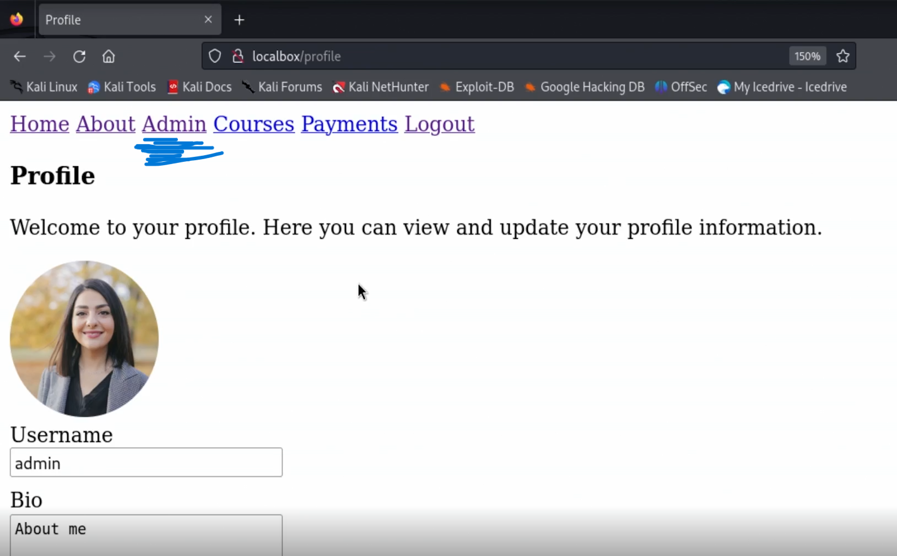

# [1] ¿Qué es OWASP Top 10?

OWASP, que significa Open Web Application Security Project, es una organización sin fines de lucro que trabaja para mejorar la seguridad
del software a través de la identificación y la divulgación de las fallas de seguridad más críticas.
OWASP ha generado múltiples propyectos de importancia como TOP 10 que recolecta los 10 riesgos más imporantes que los Devs deben considerar para mitigar vulnerariblidades.
Este listado es ampliamente reconocido y respetado en la industria de la ciberseguridad y sirve como un punto de partida para las organizaciones que buscan mitigar
los riesgos de seguridad en sus aplicaciones web.

El OWASP Top 10 se actualiza periódicamente para reflejar la evolución del paisaje de amenazas y las prácticas de seguridad.
Aunque los elementos específicos de la lista pueden cambiar con cada actualización, típicamente incluyen vulnerabilidades
como inyección SQL, cross-site scripting (XSS), exposición de datos sensibles, y configuraciones incorrectas de seguridad, entre otros.
Cada elemento de la lista incluye una descripción de la vulnerabilidad, ejemplos de cómo puede ser explotada, y recomendaciones para mitigar o prevenir el riesgo.

> OWASP Top 10 es el primer paso hacia desarrollo seguro de código. Top 10 acompaña en todo el ciclo de desarrollo de Software y se puede contribuir y participar en la comunidad OWASP.

## Las 3 variables importantes (o insumos) en OWASP T10 son:
1. [Common Weakness Enumeration](https://cwe.mitre.org/): un listado de fallas en software y hardware mantenidos por la comunidad
2. [Common Vulnerabilities and Exposures](https://www.cve.org/): Repositorio de vulnerabilidades asociados a productos, aplicaciones o activos de información
3. [National Vulnerability Database](https://nvd.nist.gov/): Repositorio de vulnerabilidades gestionado por el Gobierno de Estados Unidos

## Orden de riesgos
Para definir el orden de los riesgos en el proyecto TOP 10 de OWASP se toman en consideración las 
siguientes variables: 
- Porcentaje de aplicaciones probadas a determinado registro CWE
- Porcentaje de aplicaciones vulnerables para el mismo registro CWE
- Número de aplicaciones vulnerables asociadas al porcentaje anterior
- Número de registros CWE mapeados hacia la categoría
- Número de vulnerabilidades (O CVE's) debidamente sincronizado con la BD de vulnerabilidades del gobierno de los Estados Unidos

# [2] ¿Cómo utilizar OWASP Top 10?

La utilización del OWASP Top 10 como una herramienta para mejorar la seguridad de las aplicaciones web implica varias estrategias y prácticas.

- Una manera es crear programas de aseguramiento de aplicaciones en dónde debes incluir metas alcanzables, el ciclo de vida del desarrollo de software seguro y
finalmente, un nivel de madurez de la aplicación en dónde podemos apoyarnos de [OWASP SAMM](https://owaspsamm.org/).
> OWASP SAMM Resume los requerimientos de seguridad en funciones de negocio: Govierno, Diseño, Implementación, Verificación y Operaciones.

- También podemos usar OWASP Top 10 para crear educación continua en los equipos. Para esto podemos usar proyectos como [OWASP ASVS](https://owasp.org/www-project-application-security-verification-standard/)
  (Application Security Verification Standard, por sus siglas en inglés).
> OWASP ASVS Reune un gran listado de requerimientos de seguridad debidamente agrupados, codificados y con un código CWE asociado. 

  
A continuación, se describe un enfoque estructurado sobre cómo las organizaciones y los desarrolladores pueden hacer uso del OWASP Top 10 para fortalecer la seguridad de sus aplicaciones:

## 1. Educación y Concienciación

- **Capacitación del equipo de desarrollo:** Organizar sesiones de capacitación y talleres para los equipos de desarrollo y seguridad
   sobre las vulnerabilidades listadas en el OWASP Top 10, incluyendo sus implicaciones y cómo pueden ser explotadas.
- **Integración en el proceso de diseño:** Incluir la seguridad como un componente fundamental en las fases iniciales del diseño de aplicaciones web, utilizando el OWASP Top 10 como una guía para discutir posibles riesgos de seguridad.

## 2. Integración en el Ciclo de Desarrollo del Software

- **Revisión de código:** Implementar revisiones de código regulares que se centren específicamente en identificar patrones de código que puedan conducir a las vulnerabilidades listadas en el OWASP Top 10.
- **Pruebas de seguridad:** Utilizar herramientas automatizadas de pruebas de seguridad (como escáneres de vulnerabilidades y herramientas de análisis de código estático) que puedan identificar
   problemas relacionados con el OWASP Top 10 en las aplicaciones.

## 3. Mejora Continua

- **Remediación de vulnerabilidades:** Una vez identificadas las vulnerabilidades, es crucial priorizar y remediarlas de manera oportuna, basándose en el nivel de riesgo que cada una representa.
- **Actualización y mantenimiento:** Mantenerse al día con las últimas versiones del OWASP Top 10 y actualizar las prácticas de seguridad de la organización en consecuencia.

## 4. Políticas de Seguridad y Cumplimiento

- **Desarrollo de políticas de seguridad:** Desarrollar y mantener políticas de seguridad que incorporen los principios del OWASP Top 10, asegurando que todos los desarrollos cumplan con un estándar mínimo de seguridad.
- **Auditorías de seguridad:** Realizar auditorías de seguridad periódicas para evaluar la conformidad con el OWASP Top 10 y otras normativas de seguridad relevantes.

## 5. Adopción de Herramientas y Prácticas Recomendadas
- **Utilizar marcos de trabajo y bibliotecas seguras:** Optar por marcos de trabajo y bibliotecas que promuevan prácticas de desarrollo seguro y que estén activamente mantenidos.
- **Implementación de controles de seguridad:** Aplicar controles de seguridad específicos recomendados por OWASP para mitigar las vulnerabilidades, como el uso de Content Security Policy (CSP) para prevenir XSS,
 o la implementación de controles de acceso adecuados para prevenir la exposición de datos sensibles.

## Herramientas de práctica 
- [Proyecto Juice SHOP de OWASP](https://owasp.org/www-project-juice-shop/): Página con varios herrores de desarrollo para concientizar a los desarrolladores.
## Herramientas de laboratorio 
- [Página de pruebas para el curso](https://github.com/platzi/curso-owasp-top-10)
> Ahí encontraremos todo lo necesario en cuanto a herramientas necesarias para llevar a cabo el curso.

En lo personal me he montado Kali Linux para ahorrarme la instalación de algunas herramientas como: bupsuite o dirbuster. 
El tutorial que he seguido lo puedes ver aquí: [Como Instalar y Descargar Kali Linux 2024.1 en VirtualBox [Windows 10] - Desde Cero!](https://www.youtube.com/watch?v=iGmACGL3nos&ab_channel=ContandoBits)

--- 
# Broken Access Control [A01] 
> A partir de aquí, comienzan las pruebas usando el laboratorio.
> La lista de las 10 vulnerabiliades la puedes ver en: [OWASP TOP TEN](https://owasp.org/www-project-top-ten/)

Se refiere a una categoría de vulnerabilidades de seguridad en aplicaciones web donde las restricciones sobre
lo que los usuarios autenticados están autorizados a hacer no se implementan o se implementan incorrectamente. 
Esta vulnerabilidad ocurre cuando un usuario puede realizar acciones fuera de sus permisos previstos, como acceder a datos o realizar operaciones que deberían estar restringidas.

## Ejemplos Comunes de Broken Access Control
- **Bypass de restricciones de acceso:** Un usuario sin privilegios accede a funciones o datos
  reservados para usuarios con mayores privilegios, como acceder a perfiles de usuario, datos financieros, o realizar acciones administrativas sin las debidas autorizaciones.
- **Modificación de URL o ID de sesión:** Manipular URL o identificadores de sesión para acceder a información o realizar acciones que no deberían estar disponibles
   para el usuario autenticado.
- **Elevación de privilegios:** Un usuario con privilegios bajos manipula la aplicación para otorgarse privilegios más altos.

### Impacto

El impacto de Broken Access Control puede ser significativo y variado, dependiendo de la naturaleza de la aplicación y
los datos o funciones expuestas indebidamente. Puede conducir a la divulgación no autorizada de información sensible,
modificación de datos, realización de transacciones no autorizadas, e incluso comprometer completamente la seguridad de la aplicación web.

### Mitigación

Para mitigar las vulnerabilidades de Broken Access Control, se recomienda adoptar un enfoque de seguridad en capas que incluya:
- **Principio de menor privilegio:** Asegurarse de que los usuarios tengan solo los permisos necesarios para realizar sus tareas.
- **Autenticación y autorización robustas:** Implementar controles de acceso fuertes y asegurarse de que se verifiquen de manera consistente a lo largo de la aplicación.
- **Controles de acceso a nivel de aplicación:** Utilizar controles de acceso en el servidor, no solo en el cliente, para asegurar que los controles no puedan ser fácilmente evadidos.
- **Auditorías y registros:** Mantener registros detallados de las actividades de acceso para permitir la auditoría y la detección de accesos no autorizados o anomalías.
- **Pruebas de seguridad regulares:** Realizar pruebas de penetración y revisiones de código para identificar y remediar las vulnerabilidades de control de acceso roto antes de que puedan ser explotadas.
  Aplica correctamente rate limits para que no sea posible hacer más de cierta cantidad de peticiones por minuto. 

## PRÁCTICA BROKEN ACCESS CONTROL

NOTA: Antes de comenzar. Configura la herramienta de Burpsuite, para escuchar las peticiones 

Como primer paso, entramos a la plataforma: `localbox/` y veremos algo cómo: 

Procedemos a iniciar sesión con el usuario de administrador. 
> user: admin - password: admin
> NOTA: Los usuarios utilizados aquí se encuentran en la página del proyecto.

Una vez que iniciamos sesión como administrador podemos observar que hay una opción (Admin) a la que
solo se tiene acceso como administrador. 

Si vamos a la opción de Admin, podemos observar que nos lista los usarios de la plataforma. 

Cerramos la sesión de administrador y ahora iniciamos sesión como un usuario normal.
> user: user1 - password: 1234 

Al iniciar sesión como un usuario normal podemos observar que la opción de "Admin"
no esta disponible para este usuario. 

Si hacemos una petición al endpoint: `localbox/api/users` que es el endpoint que
se utiliza en la opción de "Admin" para listar los usuarios.
> Lo anterior lo podemos comprobar yendo a la opción "Admin" e inspeccionando la página
> a la hora de entrar a esa opción. Se hace una petición GET a ese endpoint.

Podemos observar que nos arroja el mensaje de que no estamos autorizados.  

Si vamos al historial de Burpsuite y revisamos la petición que se realizo cuando iniciamos
sesión como un usuario normal podemos ver el body utilizado pero, si observamos la respuesta,
vemos una cookie cuyo valor se ve interesante. Seleccionamos el valor para una operación posterior.

El valor que hemos notado anteriormente en la cookie, parece ser un cifrado en base 64, así que utilizando
una herramienta online, procedemos a decodificarlo. Observamos algo muuuuy llamativo.
Un diccionario con el id del usuario pero también con su rol. 

Si tomamos, ese diccionario, pero en lugar de conservar el rol "user" lo cambiamos por "admin"
y codificamos nuevamente, en base 64. Observamos que tenemos un valor similar al de la
cookie anterior. Guardamos dicho valor para su posterior uso. 

Regresamos a Burpsuite y buscamos la petición al endpoint `localbox/api/users` que anteriormente
nos había retornado que no estabamos autorizados. Observamos que dicha petición manda una cookie similar a la que hemos codificado.
Marcamos dicha petición para repetirla. 

Con el nuevo valor de cookie codificado anteriormente, realizamos un cambio de cookie en dicha petición.
Y la volvemos a enviar. Observamos que ahora la respuesta no es que no estamos autorizados sino que ahora
¡nos retorna toda la lista de usuarios! Es decir, tenemos privilegios de administrador.

## Hardening
> En informática, el hardening o endurecimiento es el proceso de asegurar un sistema reduciendo sus vulnerabilidades o agujeros de seguridad,
> para los que se está más propenso cuanto más funciones desempeña; en principio un sistema con una única función es más
> seguro que uno con muchos propósitos. (Wikipedia)

Para poder arreglar esa falla, hace falta realizar un cambio en la manera en que están validando al usuario. Si 
entramos al código fuente de este problema en el repositorio del curso. Podemos observar que se está realizando una
validación de usuario a nivel de Cookie. Por lo que cambiandola a una validación de usuario a nivel de base de datos,
podemos arreglar el problema. 
