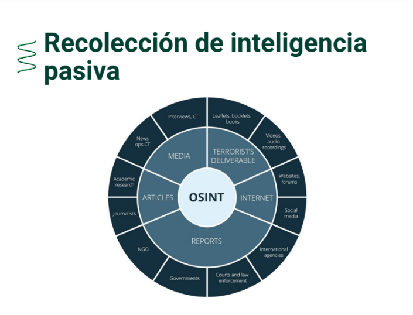

# Intro 
Antes de comenzar. Estos son algunos conocimientos básicos que necesitamos.

## Conocimientos básicos del Pentesting
Esta es una lista que te permitirá entender aquellas competencias y habilidades que necesitas para comenzar.

- Conocimiento en redes informáticas 🌐: Entender el modelo OSI para comprender los modelos de ataque que se llevan a cabo en las diferentes capas.

- Conocimiento en programación💻: Para las pruebas de tester es necesario tener conocimientos de programación.
   Cuando se realice una prueba **White box testing o Black box texting** se pueda ver qué parámetros reciben y determinar qué vulnerabilidades puede tener el sistema.
  - - **White box testing:** pruebas de seguridad cuando se tiene acceso al código fuente o los binarios y proporciona información sobre los errores y las posibles vulnerabilidades.
  - - **Black box texting:** pruebas a aplicaciones sin tener el código fuente ni la lógica. Consisten en probar una aplicación desde la perspectiva del usuario sin conocer su implementación.

-  Conocimientos básicos de bases de datos 👩‍💻: Entender cómo los datos se relacionan entre sí y cómo se realizan las consultas a la base de datos, hay ataques que dependen de esto.

- Conocimiento en el funcionamiento básico de los navegadores y aplicaciones 🔎: Cómo funciona una aplicación web y el envío de datos a los navegadores. Se puede utilizar herramientas que permiten manipular las solicitudes por medio del http.

# [1] - CVE, Microsoft Vuln Database

Existen registros de vulnerabilidades en bases de datos como CVE o Microsoft Vuln Database. Estas permiten identificar de manera única cualquier vulnerabilidad y buscar información sobre ella en dichas bases de datos.

## ¿Qué es CVE y exploit?
Un CVE expone las fallas de seguridad que se encuentran disponibles al público y el exploit es el software o código malicioso que explota una vulnerabilidad de manera automática.

Las entradas de CVE son breves y no incluyen datos técnicos ni información sobre los riesgos, el impacto o las soluciones.

MITRE Corporation es una organización que cuenta con partners que permite a los pentester registrar nuevas vulnerabilidades que se han encontrado.

## Número de identificación de un CVE
La siguiente imagen muestra el número de identificación de un CVE:

Algunos sitios de vulnerabilidades
- [CVE](https://www.cve.org/)
- [MS Vulnerabilities](https://msrc.microsoft.com/update-guide/vulnerability)
- [MS 2017 Vulnerabilities](https://learn.microsoft.com/en-us/security-updates/securitybulletins/2017/securitybulletins2017)
- [National Vulnerability Database](https://nvd.nist.gov/vuln-metrics/cvss/v3-calculator)
- [Common Weakness Enumeration](https://cwe.mitre.org/index.html)
- [Common Attack Enumeration and Classification](https://capec.mitre.org/)

## ¿Qué es eternal Blue?
Eternal Blue es una aplicación gratuita que con un solo clic, nos permite comprobar si nuestro ordenador o cualquier otro conectado a la red local es vulnerable ante EternalBlue y podemos caer víctimas de los piratas informático.

Nos dirá si nuestros ordenadores están protegidos y no hay peligro de infectados con estas vulnerabilidades.

## Otras herramientas

- [Virus Total](https://www.virustotal.com/gui/home/upload): Sirve para verificar la reputación de sitios o archivos

- [ExpandURL](https://www.expandurl.net/): Sirva para expandir URL acortadas y ver cual es el realmente el sitio de destino sin tener que ingresar a el

- [Kaspersky Pass Check](https://password.kaspersky.com/es/): Verificar qeu tan segura es una contraseña

- [Have i been pwned?](https://haveibeenpwned.com/): Sirve para verificar si tus correos o cuentas se han visto afectadas en filtraciones de información de empresas a nivel mundial.

- [PhishTank](https://phishtank.org/) : Sirve para ver si un sitio es real o es phishing

- [TALOS - Cisco](https://talosintelligence.com/): Sirve para ver la reputación de la reputación de sitios y otras cosas mas :v

- [OSINT Framework](https://osintframework.com/): Sirve apra obetener inteligencia de plataformas publicas. . Laboratorios de practica: TryHackMe OverTheWire HackTheBox .

# [2] - Enumeración de vulnerabilidades comunes (CWE)

La enumeración de vulnerabilidades comunes son un listado de vulnerabilidades que se encuentran en un software y son registrados por una entidad que las hace pública.

## ¿Cuál es la diferencia de un CWE Y CVE?
El objetivo del CWE es facilitar el uso eficaz de herramientas que puedan identificar, encontrar y resolver errores, vulnerabilidades y exposiciones en el software informático antes de que los programas se distribuyan o vendan públicamente.

### Cuadro de diferencias entre CWE Y CVE
| CWE (Common Weakness Enumeration)	| CVE (Common Vulnerability Exposure) |
| --- | --- |
|Es una entrada en la base de datos correspondiente a una debilidad y no está relacionado con un producto o sistema. | Es una entrada en la lista de vulnerabilidades, es decir, es una instancia específica de una debilidad en un producto o sistema. |
| Se clasifican las vulnerabilidades por medio de códigos: CWE-89	| Tiene un conjunto único que identifica a una vulnerabilidad: CVE-2017-0144 |

La enumeración está enfocada en la recopilación información que ayuda al Pentester o a los equipos de ciberseguridad a encontrar puntos débiles en el sistema. Es la primera tarea que debería hacer un Pentester.

## Algunos tipos de enumeración a la hora de hacer Pentesting🔎
- DNS Enumeration
- NetBIOS Enumeration
- Windows Enumeration
- SNMP Enumeration
- NTP Enumeration

# [3] - Enumeración y clasificación de patrones de ataque comunes (CAPEC)

Los patrones de ataque engloban todas las técnicas que sean utilizadas comúnmente, desde acceder físicamente a instalaciones con Lockpicking hasta técnicas de Spoofing.

## ¿Qué es CAPEC?
[CAPEC](https://capec.mitre.org/) ayuda a proporcionar un diccionario completo de patrones conocidos de ataque empleados por los adversarios para explotar las debilidades conocidas en las capacidades habilitadas para el ciberespacio.

> Aunque puede parecer similar a CWE, no lo es. Ya que las vulnerabilidades afectan a tecnologías y los patrones de ataque pueden no depender de le tecnología.

Puede ser utilizado por analistas, desarrolladores, evaluadores y educadores para avanzar en la comprensión de la comunidad y mejorar las defensas.

**Lista de mecanismos de ataques en CAPEC**

Existen muchos mecanismos de ataque, por ello aquí te dejamos un corta lista para empezar.

- Spoofing
- SQL injection
- Manipular el comportamiento humano

**Cuadro de diferencia de CWE Y CAPEC**

| CWE | CAPEC |
| --- | --- |
| Registra vulnerabilidades de software o hardware | La mayoría de patrones de ataque no entran cómo vulnerabilidad, como el spoofing (pasa por una entidad o dispositivo de confianza para conseguir beneficios para el ciberdelicuente) |

## ¿Qué es lockpicking?

El lockpicking es una disciplina que consiste en romper la seguridad de cerraduras manipulando sus componentes físicos, es decir, abrirlas sin la nececidad de la llave original.
Esto se puede utilizar para acceder a lugares que suelen estra protegidas con cerraduras y candados, lugares que un hacker requeriría acceder para lograr algún ataque en especifico.

El Lockpicking si es considerado como un patrón de ataque, lo puedes comprobar accediendo al sitio web de CAPEC con el codigo 393.

## NOTA
- CVE: Identificación única de una vulnerabilidad
- CWE: A que tipo pertenece esta vulnerabilidad
- CAPEC: Cual es el patron de ataque que esta relacionado.

> Al hacer una auditoria y crear un reporte. En el reporte tenemos que indicar cuál es la vulnerabilidad de manera única con el registro CVE, a qué patron de ataque pertenece con CAPEC y a que tipo de vulnerabilidad pertenece con CWE. 

# [4] - Sistema de puntuación de vulnerabilidades comunes [(CVSS)](https://nvd.nist.gov/vuln-metrics/cvss/v3-calculator) 

El CVSS (Common Vulnerability Scoring System) define qué tan crítica es una vulnerabilidad.
## Métricas de puntuación de vulnerabilidades

El siguiente cuadro muestra las métrica básicas y de impacto de una vulnerabilidad.

| Métrica de puntuación básica |	Métricas de impacto – Tríada CIA
| --- | --- |
| Vector de ataque (Attack Vector - AV) |	Impacto en la confidencialidad (Confidentiality Impact - C) |
| Complejidad del ataque ( Attack Complexity - AC) | Impacto en la integridad (Integrity Impact - I) |
| Privilegios requeridos (Privileges Required - PR) | Impacto en la disponibilidad (Availability Impact - A) |

**Interacción con el usuario (User Interaction - UI)**

Si la vulnerabilidad afecta una aplicación web es un ataque remoto.
Si requiere dentro de un ataque de un equipo de la red utilizando protocolo SMB, es un ataque de red.

## ¿Qué significa la puntuación en vulnerabilidad?

Como el CVSS en realidad es una fórmula. Es un sistema que tiene en cuenta diferentes aspectos para dar una valoración de 0 a 10 a esa vulnerabilidad.

- Mientras más cerca se encuentre del 10, más peligro representa para los usuarios.
- Cuando la puntuación es entre 0 y 3,9 se considera una vulnerabilidad de severidad baja.
- Cuando la cifra resultante se encuentra entre 4 y 6,9 estaríamos ante una de peligrosidad media.
- Mientras que de 7 a 10 son las más peligrosas.

# [5] - Seguridad por oscuridad

Seguridad por oscuridad es un término que viene a identificar aquellas medidas que se configuran para proteger un activo, confiando en que nadie va a buscar ahí.

> En palabras de Auguste Kerckhoffs:
> “el diseño de un sistema no debería requerir el secreto, y el compromiso del sistema no debería incomodar a los corresponsales”.

## Principios de la seguridad por oscuridad

**Se basa en los principios de Kerckhoffs** que describe la seguridad en un sistema criptográfico.

- Si el sistema no es teóricamente irrompible, al menos debe serlo en la práctica.
- La efectividad del sistema no debe depender de que su diseño permanezca en secreto.
- La clave debe ser fácilmente memorizable de manera que no haya que recurrir a notas escritas.
- Los criptogramas deberán dar resultados alfanuméricos.
- El sistema debe ser operable por una única persona.
- El sistema debe ser fácil de utilizar.

## Cuadro de diferencias sobre cómo clasificar vulnerabilidades
| CVE(Common Vulnerability Exposure) |	CWE (Common Weakness Enumeration) | CAPEC | CVS (Common Vulnerability Scoring) |
| --- | --- | --- | --- |
| Listas de vulnerabilidades con un único identificador | Registra vulnerabilidades de software o hardware, se clasifican por medio de códigos | Son patrones de ataque que no dependen de una vulnerabilidad | Define qué tan crítica es una vulnerabilidad | 

> Seguridad por oscuuridad es tratar de proteger algo, solo ocultandolo. P. ej. Mi sistema con el que manejo empleados tiene que ser puesto en Internet. Para protegerlo lo ubico en el
> puerto número 65000. Asumiendo que quien nos ataque no buscará en todos los puerto. Pero esto realmente no es del todo seguro. No lo utilices.

# [6] - Obtención de Inteligencia

La obtención de inteligencia se utiliza para descubrir y recopilar información para conocer el sistema de destino. También analiza la información para identificar rutas de ataques.

## Ciclo de vida del pentesting

1. Obtención de inteligencia. Su objetivo es obtener y analizar información para identificar y predecir posibles amenazas.

### Subfases

- **Recoleción inteligente pasiva:**

**Obtener información de fuentes abiertas (OSINT - Open Source Intelligence)**.

- [Mapa OSINT](https://map.malfrats.industries/)
- [OPEN SOURCE INTELLIGENCE TOOLS AND RESOURCES HANDBOOK 2020](https://i-intelligence.eu/uploads/public-documents/OSINT_Handbook_2020.pdf) <- Libro

- **Recolección inteligente semipasiva:**

Obtiene información pública. **Se interactúa con los servidores** de las empresas que queremos recolectar información, ejemplo: conocer la estructura de una aplicación web haciendo peticiones.

- **Recolección inteligente activa:**

Peticiones o paquetes intrusivas. Interactuará directamente con el sistema informático para obtener información, ejemplos: mapeo de red o puertos (nmap).
