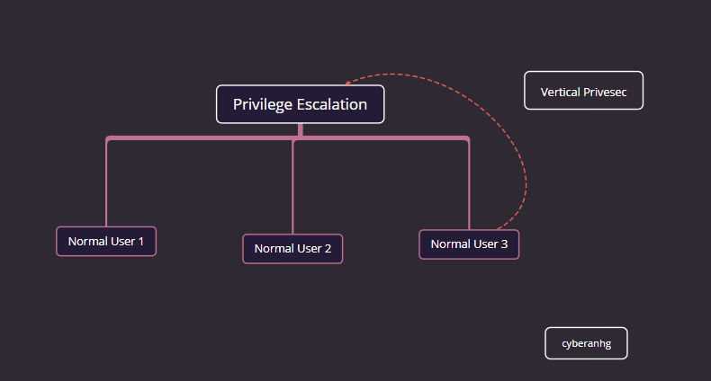
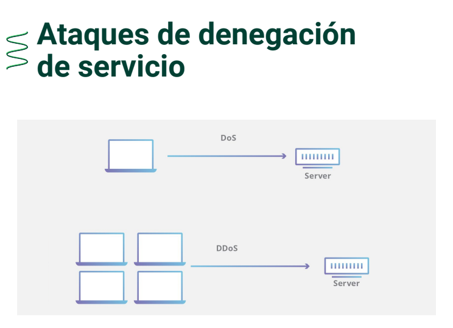

# Intro 
Antes de comenzar. Estos son algunos conocimientos básicos que necesitamos.

## Conocimientos básicos del Pentesting
Esta es una lista que te permitirá entender aquellas competencias y habilidades que necesitas para comenzar.

- Conocimiento en redes informáticas 🌐: Entender el modelo OSI para comprender los modelos de ataque que se llevan a cabo en las diferentes capas.

- Conocimiento en programación💻: Para las pruebas de tester es necesario tener conocimientos de programación.
   Cuando se realice una prueba **White box testing o Black box texting** se pueda ver qué parámetros reciben y determinar qué vulnerabilidades puede tener el sistema.
  - - **White box testing:** pruebas de seguridad cuando se tiene acceso al código fuente o los binarios y proporciona información sobre los errores y las posibles vulnerabilidades.
  - - **Black box texting:** pruebas a aplicaciones sin tener el código fuente ni la lógica. Consisten en probar una aplicación desde la perspectiva del usuario sin conocer su implementación.

-  Conocimientos básicos de bases de datos 👩‍💻: Entender cómo los datos se relacionan entre sí y cómo se realizan las consultas a la base de datos, hay ataques que dependen de esto.

- Conocimiento en el funcionamiento básico de los navegadores y aplicaciones 🔎: Cómo funciona una aplicación web y el envío de datos a los navegadores. Se puede utilizar herramientas que permiten manipular las solicitudes por medio del http.

# [1] - CVE, Microsoft Vuln Database

Existen registros de vulnerabilidades en bases de datos como CVE o Microsoft Vuln Database. Estas permiten identificar de manera única cualquier vulnerabilidad y buscar información sobre ella en dichas bases de datos.

## ¿Qué es CVE y exploit?
Un CVE expone las fallas de seguridad que se encuentran disponibles al público y el exploit es el software o código malicioso que explota una vulnerabilidad de manera automática.

Las entradas de CVE son breves y no incluyen datos técnicos ni información sobre los riesgos, el impacto o las soluciones.

MITRE Corporation es una organización que cuenta con partners que permite a los pentester registrar nuevas vulnerabilidades que se han encontrado.

## Número de identificación de un CVE
La siguiente imagen muestra el número de identificación de un CVE:


Algunos sitios de vulnerabilidades
- [CVE](https://www.cve.org/)
- [MS Vulnerabilities](https://msrc.microsoft.com/update-guide/vulnerability)
- [MS 2017 Vulnerabilities](https://learn.microsoft.com/en-us/security-updates/securitybulletins/2017/securitybulletins2017)
- [National Vulnerability Database](https://nvd.nist.gov/vuln-metrics/cvss/v3-calculator)
- [Common Weakness Enumeration](https://cwe.mitre.org/index.html)
- [Common Attack Enumeration and Classification](https://capec.mitre.org/)

## ¿Qué es eternal Blue?
Eternal Blue es una aplicación gratuita que con un solo clic, nos permite comprobar si nuestro ordenador o cualquier otro conectado a la red local es vulnerable ante EternalBlue y podemos caer víctimas de los piratas informático.

Nos dirá si nuestros ordenadores están protegidos y no hay peligro de infectados con estas vulnerabilidades.

## Otras herramientas

- [Virus Total](https://www.virustotal.com/gui/home/upload): Sirve para verificar la reputación de sitios o archivos

- [ExpandURL](https://www.expandurl.net/): Sirva para expandir URL acortadas y ver cual es el realmente el sitio de destino sin tener que ingresar a el

- [Kaspersky Pass Check](https://password.kaspersky.com/es/): Verificar qeu tan segura es una contraseña

- [Have i been pwned?](https://haveibeenpwned.com/): Sirve para verificar si tus correos o cuentas se han visto afectadas en filtraciones de información de empresas a nivel mundial.

- [PhishTank](https://phishtank.org/) : Sirve para ver si un sitio es real o es phishing

- [TALOS - Cisco](https://talosintelligence.com/): Sirve para ver la reputación de la reputación de sitios y otras cosas mas :v

- [OSINT Framework](https://osintframework.com/): Sirve apra obetener inteligencia de plataformas publicas. . Laboratorios de practica: TryHackMe OverTheWire HackTheBox .

# [2] - Enumeración de vulnerabilidades comunes (CWE)

La enumeración de vulnerabilidades comunes son un listado de vulnerabilidades que se encuentran en un software y son registrados por una entidad que las hace pública.

## ¿Cuál es la diferencia de un CWE Y CVE?
El objetivo del CWE es facilitar el uso eficaz de herramientas que puedan identificar, encontrar y resolver errores, vulnerabilidades y exposiciones en el software informático antes de que los programas se distribuyan o vendan públicamente.

### Cuadro de diferencias entre CWE Y CVE
| CWE (Common Weakness Enumeration)	| CVE (Common Vulnerability Exposure) |
| --- | --- |
|Es una entrada en la base de datos correspondiente a una debilidad y no está relacionado con un producto o sistema. | Es una entrada en la lista de vulnerabilidades, es decir, es una instancia específica de una debilidad en un producto o sistema. |
| Se clasifican las vulnerabilidades por medio de códigos: CWE-89	| Tiene un conjunto único que identifica a una vulnerabilidad: CVE-2017-0144 |

La enumeración está enfocada en la recopilación información que ayuda al Pentester o a los equipos de ciberseguridad a encontrar puntos débiles en el sistema. Es la primera tarea que debería hacer un Pentester.

## Algunos tipos de enumeración a la hora de hacer Pentesting🔎
- DNS Enumeration
- NetBIOS Enumeration
- Windows Enumeration
- SNMP Enumeration
- NTP Enumeration

# [3] - Enumeración y clasificación de patrones de ataque comunes (CAPEC)

Los patrones de ataque engloban todas las técnicas que sean utilizadas comúnmente, desde acceder físicamente a instalaciones con Lockpicking hasta técnicas de Spoofing.

## ¿Qué es CAPEC?
[CAPEC](https://capec.mitre.org/) ayuda a proporcionar un diccionario completo de patrones conocidos de ataque empleados por los adversarios para explotar las debilidades conocidas en las capacidades habilitadas para el ciberespacio.

> Aunque puede parecer similar a CWE, no lo es. Ya que las vulnerabilidades afectan a tecnologías y los patrones de ataque pueden no depender de le tecnología.

Puede ser utilizado por analistas, desarrolladores, evaluadores y educadores para avanzar en la comprensión de la comunidad y mejorar las defensas.

**Lista de mecanismos de ataques en CAPEC**

Existen muchos mecanismos de ataque, por ello aquí te dejamos un corta lista para empezar.

- Spoofing
- SQL injection
- Manipular el comportamiento humano

**Cuadro de diferencia de CWE Y CAPEC**

| CWE | CAPEC |
| --- | --- |
| Registra vulnerabilidades de software o hardware | La mayoría de patrones de ataque no entran cómo vulnerabilidad, como el spoofing (pasa por una entidad o dispositivo de confianza para conseguir beneficios para el ciberdelicuente) |

## ¿Qué es lockpicking?

El lockpicking es una disciplina que consiste en romper la seguridad de cerraduras manipulando sus componentes físicos, es decir, abrirlas sin la nececidad de la llave original.
Esto se puede utilizar para acceder a lugares que suelen estra protegidas con cerraduras y candados, lugares que un hacker requeriría acceder para lograr algún ataque en especifico.

El Lockpicking si es considerado como un patrón de ataque, lo puedes comprobar accediendo al sitio web de CAPEC con el codigo 393.

## NOTA
- CVE: Identificación única de una vulnerabilidad
- CWE: A que tipo pertenece esta vulnerabilidad
- CAPEC: Cual es el patron de ataque que esta relacionado.

> Al hacer una auditoria y crear un reporte. En el reporte tenemos que indicar cuál es la vulnerabilidad de manera única con el registro CVE, a qué patron de ataque pertenece con CAPEC y a que tipo de vulnerabilidad pertenece con CWE. 

# [4] - Sistema de puntuación de vulnerabilidades comunes [(CVSS)](https://nvd.nist.gov/vuln-metrics/cvss/v3-calculator) 

El CVSS (Common Vulnerability Scoring System) define qué tan crítica es una vulnerabilidad.
## Métricas de puntuación de vulnerabilidades

El siguiente cuadro muestra las métrica básicas y de impacto de una vulnerabilidad.

| Métrica de puntuación básica |	Métricas de impacto – Tríada CIA
| --- | --- |
| Vector de ataque (Attack Vector - AV) |	Impacto en la confidencialidad (Confidentiality Impact - C) |
| Complejidad del ataque ( Attack Complexity - AC) | Impacto en la integridad (Integrity Impact - I) |
| Privilegios requeridos (Privileges Required - PR) | Impacto en la disponibilidad (Availability Impact - A) |

**Interacción con el usuario (User Interaction - UI)**

Si la vulnerabilidad afecta una aplicación web es un ataque remoto.
Si requiere dentro de un ataque de un equipo de la red utilizando protocolo SMB, es un ataque de red.

## ¿Qué significa la puntuación en vulnerabilidad?

Como el CVSS en realidad es una fórmula. Es un sistema que tiene en cuenta diferentes aspectos para dar una valoración de 0 a 10 a esa vulnerabilidad.

- Mientras más cerca se encuentre del 10, más peligro representa para los usuarios.
- Cuando la puntuación es entre 0 y 3,9 se considera una vulnerabilidad de severidad baja.
- Cuando la cifra resultante se encuentra entre 4 y 6,9 estaríamos ante una de peligrosidad media.
- Mientras que de 7 a 10 son las más peligrosas.

# [5] - Seguridad por oscuridad

Seguridad por oscuridad es un término que viene a identificar aquellas medidas que se configuran para proteger un activo, confiando en que nadie va a buscar ahí.

> En palabras de Auguste Kerckhoffs:
> “el diseño de un sistema no debería requerir el secreto, y el compromiso del sistema no debería incomodar a los corresponsales”.

## Principios de la seguridad por oscuridad

**Se basa en los principios de Kerckhoffs** que describe la seguridad en un sistema criptográfico.

- Si el sistema no es teóricamente irrompible, al menos debe serlo en la práctica.
- La efectividad del sistema no debe depender de que su diseño permanezca en secreto.
- La clave debe ser fácilmente memorizable de manera que no haya que recurrir a notas escritas.
- Los criptogramas deberán dar resultados alfanuméricos.
- El sistema debe ser operable por una única persona.
- El sistema debe ser fácil de utilizar.

## Cuadro de diferencias sobre cómo clasificar vulnerabilidades
| CVE(Common Vulnerability Exposure) |	CWE (Common Weakness Enumeration) | CAPEC | CVS (Common Vulnerability Scoring) |
| --- | --- | --- | --- |
| Listas de vulnerabilidades con un único identificador | Registra vulnerabilidades de software o hardware, se clasifican por medio de códigos | Son patrones de ataque que no dependen de una vulnerabilidad | Define qué tan crítica es una vulnerabilidad | 

> Seguridad por oscuuridad es tratar de proteger algo, solo ocultandolo. P. ej. Mi sistema con el que manejo empleados tiene que ser puesto en Internet. Para protegerlo lo ubico en el
> puerto número 65000. Asumiendo que quien nos ataque no buscará en todos los puerto. Pero esto realmente no es del todo seguro. No lo utilices.

# [6] - Obtención de Inteligencia

La obtención de inteligencia se utiliza para descubrir y recopilar información para conocer el sistema de destino. También analiza la información para identificar rutas de ataques.

## Ciclo de vida del pentesting

## Objetivos
- La inteligencia se ocupa de obtener y analizar la información para identificar y predecir amenazas
- Llevar a cabo toma de decisiones de manera inteligente

### Subfases

- **Recoleción inteligente pasiva:**

**Obtener información de fuentes abiertas (OSINT - Open Source Intelligence)**.

> Pueden ser: noticieros, revistas cientificas o generales, artículos, Internet, etc. Todo lo que es público. 

- [Mapa OSINT](https://map.malfrats.industries/)
- [OPEN SOURCE INTELLIGENCE TOOLS AND RESOURCES HANDBOOK 2020](https://i-intelligence.eu/uploads/public-documents/OSINT_Handbook_2020.pdf) <- Libro


- **Recolección inteligente semipasiva:**

Obtiene información pública. La diferencia con la forma pasiva es que aquí **se interactúa con los servidores** de las empresas que queremos recolectar información.
Ejemplo: conocer la estructura de una aplicación web haciendo peticiones. La empresa sabe que nosotros hicimos las solicitudes y aunque es pública, se puede pensar que 
queremos hackear la empresa. 

- **Recolección inteligente activa:**

Interactuará directamente con empleados de la organización, con el sistema informático de la organización. Enviaos peticiones o paquetes de manera intrsiva. 
Todo con la finalidad de obtener información.
Ejemplos: mapeo de red o puertos (nmap). Y esto, si no tenemos el permiso de la compañia, puede ser considerado ilegal si no tenemos el permiso de la empresa. 

# [7] Análisis de vulnerabilidades (2da fase del ciclo de vida del pentesting)

> Identificar vulnerabilidades no es corregir fallos. Significa encontrar brechas que pueden exponer amenazas.

**Objetivos:**
- Identificar las deficiencias de seguridad en un sistema informático
- Definir el alcance probable de las amenazas
  

## Herramientas para identificar vulnerabilidades

Existen dos herramientas que te serán muy útiles. Ambas ayudan a identificar las vulnerabilidades y comprobar 
su ejecutividad en los sistemas, identificar y confirmar si es vulnerable. Permiten el alcance de la amenaza,
qué se puede saber y hasta dónde un atacante puede llegar.

## Blind SQL Injection

Es un tipo de ataque de inyección SQL que hace preguntas verdaderas o falsas a la base de datos y determina la respuesta basándose en
la respuesta de las aplicaciones.

## Website Crawling

Es la obtención automatizada de páginas web mediante un proceso de software, cuyo objetivo es indexar el contenido de los sitios web para que puedan ser buscados.
El rastreador analiza el contenido de una página en busca de enlaces a las siguientes páginas para obtenerlas e indexarlas.

## Lista de escáneres disponibles

Aquí tienes una lista de escáneres para vulnerabilidades

**Para la web:**
- Acunetix
- **Netsparker**
- Vega
- Burpsuite Pro
- Wpscan (exclusivo para Wordpress)
- Joomscan ( exclusivo para Joomla)
- Wapiti
- W3af
- Nikto
- Modulos de Metasploit Framework
- [Vega (Subgraph)](https://subgraph.com/vega/) - Programa con GUI para analisar WEB según OWASP TOP 10 con un reporte completo
**Redes:**

- OpenVAS que la version free/OpenSource de Nessus
- Nessus
- Nexpose
- Nmap (Scripting Engine)
- Modulos de Metasploit Framework
- OpenVAS (la version free/OpenSource de Nessus)

> Una buena cantidad de las herraientas mencionadas previamente ya vienen por defecto en Kali Linux

# [8] - Técnicas de ataque y explotación de vulnerabilidades

## Objetivos: 
- Definir los vectores de ataque con base en la inteligencia recabada y a las vulnerabilidades identificadas
- Verificar la existencia y explotación de las vulnerabilidades

 Algunos ejemplos de vectores de ataque incluyen:

- Atacar las vulnerabilidades encontradas
- Ataques misceláneos (aquellos que no entran en una categoría)
- - P. ej. Ataques de denegación de servicio, ataques de fuerza bruta
- Ingeniería social
- Ataques de acceso físico

## ¿Qué es un exploit de día cero?

Un "día cero" o "0Day" en el ámbito de la ciberseguridad es una vulnerabilidad en un dispositivo conectado a Internet, componente de red o pieza de software que acaba de ser descubierto o expuesto.
La idea es que esta vulnerabilidad no tiene historia previa, es decir, tiene cero días de existencia.

## ¿Por qué son tan importante los 0 day?

Las vulnerabilidades de día cero son el tipo de vulnerabilidad más difícil de proteger, ya que pocas empresas de seguridad y muy pocos paquetes de software antivirus (si es que hay alguno)
están preparados para manejarlas o el malware que intenta explotarlas.

Cuando se descubre una vulnerabilidad de día cero, no hay parches disponibles para resolver el problema, y no hay otras estrategias de mitigación porque todos se acaban de enterar de la vulnerabilidad.

> [Zerodium](https://zerodium.com/) es una empresa que compra exploits de día cero.  

# [9] - Post-explotación

## Objetivos 
- Identificar vulnerabilidades locales
- Obtener privilegios de sistema
- Identificar el alcance probado de una amenaza
- Obtener información
- Escalar a otros sistemas

Prueba la existencia de una amenaza o permite obtener información de la organización y del sistema con el escalado de privilegios.
También identifica las vulnerabilidades locales y el alcance de la amenaza.

## ¿Qué es el escalamiento de privilegio?

La escalada de privilegios es la explotación de una vulnerabilidad en un sistema operativo o aplicación, ya sea en Windows, Linux o MacOs.
Esta vulnerabilidad puede ser un defecto de diseño o un descuido de configuración, y permite obtener autorización a recursos que normalmente están restringidos al usuario.

Este tipo de ataque es importante porque permite obtener niveles de administrador (root).

## ¿Qué puedo hacer al escalar privilegios?

- Resetear contraseñas
- Eludir el control de acceso para comprometer los datos protegidos
- Editar la configuración del software
- Puede acceder a la máquina de nuevo más tarde
- Cambiar los privilegios de los usuarios



El **escalamiento vertical** se da cuando se tiene acceso a una cuenta existe que permita escalar hasta el root.


El **escalamiento horizontal** toma el control de diferentes usuarios hasta llegar al root.

# [10] - Desarrollo de informes (última fase dentro del ciclo de vida del pentesting)

## Objetivos

- Documentar los hallazgos de fuga de información
- Documentar las vulnerabilidades encontradas
- Establecer la urgencia de resolución de vulnerabilidades (Definir su nivel de criticidad)
- Identificar el alcance de un ataque al no solucionar los hallazgos mencionados

**Existen informes ejecutivos** como los que te da la herramienta Nezzus (herramienta para identificar vulnerabilidades). 
También existen los **informes técnicos** que deben de mostrar la mayor cantidad de información sobre el hallazgo. 
La descripción de la vulnerabilidad encontrada, cómo solucionarlo, referencias externas, qué tan fácil se puede explotar, 
que puerto afecta o en que segmento de la app afecta. Si se debe solucionar de manera inmediata o no. 

También se debe mostrar cómo esta clasificada. Su referencia CWE, su referencia CVE, Su CVSS score, etc. (En ocasiones se muestra su registro CAPEC).

# Resumen del ciclo de vida del Pentesting

1. Fase [1] - Recolección de inteligencia: Se obtiene información vital que se utilizará durante las otras fases.
2. Fase [2] - Análisis de vulnerabilidades: Éxiste software automatizado que identifica vulnerabilidades y nos puede arrojar un reporte
   con vulnerabiliades que nosotros debemos comprobar si son o no explotables. Que eso se realizará durante la fase de explotación
3. Fase [3] - Explotación: Fase para validar la explotabilidad de las vulnerabilidades encontradas y descartar a los falsos positivos.
4. Fase [4] - Post-Explotación: Aquí comprobamos que es posible accesar a otro sistema mediante el sistema comprometido.
5. Fase [5] - Desarrollo de informe: Una vez identificados los hallazgos de explotabilidad. Tenemos que comprobarlo y registrarlo en
   un informe que después será entregado a personal especializado. Puede ser un informe técnico (informe detallado que utilizará el especialista para
   solucionar las vulnerabiliades encontradas) o un informe ejecutivo (resumen de los hallazgos).

# [11] - Vulnerabiliades de tipo 0-Day

Un "día cero" o "0Day" es una vulnerabilidad en un dispositivo conectado a Internet, componente de red o pieza de software que ha sido recientemente descubierta o expuesta. 
No hay un parche disponible para protegerse contra un 0-day.

**Zerodium es una plataforma premium de "bug bounty" cuyo objetivo es la investigación de vulnerabilidades y explotaciones de día cero.**

## ¿Qué es exactamente un Bug Bounty?

Un **bug bounty** es una recompensa monetaria que se otorga a los hackers éticos por descubrir y reportar con éxito una vulnerabilidad o bug al desarrollador de la aplicación.
Esto puede aumentar las posibilidades de que se encuentren errores y se les informe antes de que los hackers malintencionados puedan explotarlos.

## Plataformas para formarse como Boug Bounty Hunter
- [HTB Academy: Bug Bounty Hunter](https://academy.hackthebox.com/path/preview/bug-bounty-hunter)
- [HackerOne](https://www.hackerone.com/)
- [Bug Bounty](https://bug-bounty.com/programs/)

 # [12] ¿Qué son los exploits y los payloads?
 
 **Todos los exploit necesitan un payload, el exploit ejecuta la vulnerabilidad y el payload hace la acción en el sistema.**

Veamos la definición de cada uno.

## ¿Qué es exploit?

Hace referencia a los pasos a seguir o el método que se refiere para explotar una vulnerabilidad.
También se hace referencia al scripts, código o programa que explota la vulnerabilidad de manera automática.

## ¿Qué son payloads?

Se encarga de ejecutar una acción dentro del sistema explotado.
Puede ser el comando para ejecutar una acción donde puede establecer una conexión entre el atacante y el sistema infectado y poder controlarlo. 

> El exploit se encarga de explotar la vulnerabilidad y llevar al payload a dónde debe de llegar para ejecutar alguna acción dentro del sistema.
> Puede ser un comando para iniciar una conexión entre tu equipo y el equipo infectado por ejemplo.

# [13] Bases de datos de exploits

Existen bases de datos de exploits que nos pueden servir durante nuestra auditorias y también herramientas que nos pueden 
ayudar a buscar en ellas.

- [Exploit-DB](https://www.exploit-db.com/)
- [0DAY](https://0day.today/)
- Una BD no oficial es Github: P. ej: github exploit vsftp 2.3.4
- - Si buscas de la forma: Github exploit <<NombreTecnología>> <<Versión>>

**SearchSploit** es una herramienta de búsqueda en línea de comandos para **[Exploit-DB](https://www.exploit-db.com/)**.
Además, permite llevar una copia de la base de datos de Exploit que buscará todos los exploits y shellcode.

## ¿Cómo instalar SearchSploit?

**Kali Linux, el paquete exploitdb ya está incluido por defecto.** 
Sin embargo, si se está utilizando la variante Kali Light o su propia ISO personalizada, puede instalar el paquete manualmente como sigue:

```
 $ sudo apt update && sudo apt -y install exploitdb
```

Si no utilizas Kali Linux, es posible que el paquete exploitdb no esté disponible a través del gestor de paquetes,
en cuyo caso, puedes continuar siguiendo las instrucciones "How to Install SearchSploit" de Exploit Database.

# [14] - Tipos de exploits

**Los exploits se refieren a scripts, código o programas que explotan vulnerabilidades de manera automática. Su función es ejecutar una acción (payload) dentro del sistema explotado.**

## Categoría de los exploits

- **Ataque de Dengación de Servicio (DoS):** El objetivo es impedir que el dispositivo esté disponible para los usuarios a los que está dirigido,
 interrumpiendo su funcionamiento normal (usualmente mediante la explotación de una vulnerabilidad).

- **Local:** Escalación de privilegios localmente en un sistema a través de binarios o scripts que explotan vulnerabilidades para escalar privilegios (se utilizan, usualmente cuando ya te encuentras dentro del sistema).

- **Remoto:** Permite tomar control de manera remota (aún si nos encontramos en la misma red, pero estamos accediendo a el de manera remota).

- **WEBAPPS:** Afectan los plugin de las aplicaciones web.

# [15] - Ataques de fuerza bruta

Un ataque de fuerza bruta es un intento de descifrar una contraseña o nombre de usuario, de buscar una página web oculta o de descubrir la clave utilizada para cifrar un mensaje.

## Herramientas de Fuerza Bruta:

- **Hydra:** Es una herramienta de inicio de sesión en red paralelizada.
- **JhonTheRipper:** Es una herramienta rápida de recuperación de contraseñas.
- **Hashcat:** Es la herramienta de recuperación de contraseñas más rápida y avanzada del mundo.
- **BurpSuite:** Es un proxy que también puede ser utilizado para realizar ataques de diccionario.

## Algoritmo Hash

Una función criptográfica hash, comúnmente conocida como "hash", es un algoritmo matemático que transforma cualquier bloque arbitrario de datos en una nueva serie de caracteres con una longitud fija.

# [16] - Ataques de denegación de servicio 

Los ataques de DDoS (denegación de servicio distribuida) provienen de múltiples atacantes que inundan o colapsan el tráfico. 
Estos ataques pueden dirigirse a redes inalámbricas, interrumpiendo las señales legítimas al enviar señales electromagnéticas, o a servicios web, entre otros.



## Ataques DoS vs. ataques DDoS

**Los ataques DDoS son más difíciles de mitigar que los ataques DoS debido a su naturaleza distribuida.** 
Además, los atacantes pueden utilizar técnicas de enmascaramiento de IP para ocultar su verdadera ubicación, lo que dificulta aún más la identificación y eliminación del tráfico malintencionado.

## Ataques DoS
- Utilizan un único dispositivo corrupto para inundar el objetivo
- Normalmente se dirigen a una víctima específica

## Ataques DDoS
- Utilizan redes zombis para inundar el objetivo
- Se dirigen a redes más grandes para afectar a más usuarios
