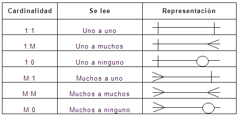

# Fundamentos de las bases de datos

- **Tipos de bases de datos:**
- - Relacionales: Microsoft SQL Server, MariaDB, PostgresSQL, MySql, Oracle
- - No Relacionales: Cassandra, elastisearh, dynamodb, bigquery, neo4j(basada en grafos), MongoDB, firestore

- **Servicios:**
- - Administrados: Servicios que ofrecen las nubes modernas
- - Autoadministrados: Tú instalas, tú te encargas de actualizaciones y mantenimiento, etc

# Historia de las RDB (Relational Data Base)

Anteriormente se usaban **bases de datos basadas en archivos**, el cual era texto plano fácil de guardar pero difícil de extraer, por 
eso se inventarón las bases de datos relacionales. En 1990 Edgar Cood (**inventor de las bases de datos relacionales**) presto atención al 
hecho de que los sistemas de gestión de bases de datos (SGBD) que se supone eran relacionales, no lo eran en realidad. 

## Las 12 reglas y mandamientos de Edgar Frank Ted Codd

- **Regla 0:** Regla de fundación
> Cualquier sistema que se proclame como relacional, debe ser capaz de gestionar sus bases de datos enteramente mediante sus capacidades relacionales.

- **Regla 1:** Regla de la información
> a) Todos los datos deben estar almacenados en las tablas
> b) Esas tablas deben cumplir las premisas del modelo relacional
> c) No puede haber información a la que accedemos por otra vía

- **Regla 2:** Regla del acceso garantizado
> a) Cualquier dato es accesible sabiendo la clave de su fila y el nombre de su columna o atributo
> b) Si a un dato no podemos acceder de esta forma, no estamos usando un modelo relacional

- **Regla 3:** Regla del tratamiento sistemático de valores nulos
> a) Esos valores pueden dar significado a la columna que los contiene
> b) El SGBD debe tener la capacidad de manejar valores nulos
> c) El SGBD reconocerá este valor diferenciándolo de cualquier otro
> d) El SGBD deberá aplicársele la lógica apropiada
> e) Es un valor independiente del tipo de datos de la columna

- **Regla 4:** Catálogo dinámico en línea basado en el modelo relacional
> a) El catálogo en línea es el diccionario de datos
> b) El diccionario de datos se debe de poder consultar usando las mismas técnicas que para los datos
> c) Los metadatos, por tanto, se organizan también en tablas relacionales
> d) Si SELECT es una instrucción que consulta datos, también será la que consulta los metadatos

- **Regla 5:** Regla comprensiva del sublenguaje de los datos completo
> a) Al menos tiene que existir un lenguaje capaz de hacer todas las funciones del SGBD
> b) No puede haber funciones fuera de ese lenguaje
> c) Puede haber otros lenguajes en el SGBD para hacer ciertas tareas
> d) Pero esas tareas también se deben poder hacer con el “lenguaje completo”

- **Regla 6:** Regla de actualización de vistas
> a) Las vistas tienen que mostrar información actualizada
> b) No puede haber diferencias entre los datos de las vistas y los datos de las tablas base

- **Regla 7:** Alto nivel de inserción, actualización, y cancelación
> a) La idea es que el lenguaje que maneja la base de datos sea muy humano
> b) Eso implica que las operaciones del lenguaje de manipulación de los datos (DML) trabajen con conjuntos de filas a la vez
> c) Para modificar, eliminar o añadir datos, no hará falta programar de la forma en la que lo hacen los lenguajes de tercera generación como C o Java

- **Regla 8:** Independencia física de los datos
> a) Cambios en la física de la BD no afecta a las aplicaciones ni a los esquemas lógicos
> b) El acceso a las tablas (elemento lógico) no cambia porque la física de la base de datos cambie

- **Regla 9:** Independencias lógicas de los datos
> a) Cambios en el esquema lógico (tablas) de la BD no afectan al resto de esquemas
> b) Si cambiamos nombres de tabla, o de columna o modificamos información de las filas, las aplicaciones (esquema externo) no se ven afectadas
> c) Es más difícil de conseguir

- **Regla 10:** Independencia de la integridad
> a) Las reglas de integridad (restricciones) deben de ser gestionadas y almacenadas por el SGBD

- **Regla 11:** Independencia de la distribución
> a) Que la base de datos se almacene o gestione de forma distribuida en varios servidores, no afecta al uso de esta ni a la programación de las aplicaciones de usuario
> b) El esquema lógico es el mismo independientemente de si la BD es distribuida o no

**Regla 12:** La regla de la no subversión.
> a) La base de datos no permitirá que exista un lenguaje o forma de acceso, que permita saltarse las reglas anteriores

# Entidades y atributos

Una de las nomenclaturas utilizadas en las bases de datos para representar entidades se llama **notación chen**

- Un **objeto o entidad** es algo que representa una objeto de el mundo real. 
> **Es representado por un rectangulo** y por convención va en **plural**

- Los atributos son caracteristicas que componen el objeto
> **Es representado por un ovalo**

- Por ejemplo, si tenemos el objeto automóvil
- - Sus atributos serían: 
- - - volante (un ovalo)
- - - llantas (en doble ovalo)
- - - motor (un ovalo, atributo compuesto)
- - - modelo (ovalo punteado)
- - - num. serie (ovalo,  palabra subrayada)

> El doble ovalo representa que es un atributo multivaluado, es decir tiene varios de ellos. En este caso un auto tiene cuatro llantas
> El atributo compuesto representa un atributo que a su vez tiene más atributos 
> El ovalo punteado representa un atributo calculado 
> La palabra subrayada nos representa el **atributo llave** de nuestra entidad 

- Los **atributos llave** pueden ser de dos tipos: 
- - Naturales [inherente al objeto]: El número de serie, el ISB de un libro. Son atributos que no puedes separarlos del objeto 
- - Artificiales [No inherente al objeto]: Lo asignas tú de manera arbitraría para poder identificar al objeto 

- Hay dos **tipos de entidades**: 
- - **Entidades débiles**: No puede existir sin ninguna entidad fuerte (se representan por **rectangulo doble**)
- - - **Entidades débiles por identidad**: No se diferencian entre sí más que por la clave de su entidad fuerte (tienen el id de la entidad fuerte)
- - - **Entidades débiles por existencia**: Asignamos su propio id, su propia identidad, pero la tabla sigue dependiendo de la entidad fuerte 
- - **Entidades fuertes**: No dependen de ninguna otra entidad para existir 

# Relaciones 

Las relaciones, **representadas por un rombo**, sirven para crear relaciones entre entidades.
Por convención las relaciones **son verbos que conectan entidades**.
> Existen entidades multivaluadas o compuestas que tienen vida propia y se relacionan con otras entidades, por lo que se pueden normalizar
>  (concepto que se explicará luego)

# Cardinalidad

_Es una propiedad de las relaciones_ que **indica la cantidad y correspondencia con la que puede estar relacionada una entidad** y puede ser **uno a uno**, **uno a varios**, **varios a uno** y **varios a varios**.
> Para elegir la cardinalidad se toma el número mayor de ambos lados 

# Diagrama Físico: tipos de datos y constraints

## Tipos de datos:
    - **Texto**: CHAR(n), VARCHAR(n), TEXT
    - **Números**: INTEGER, BIGINT, SMALLINT, DECIMAL(n,s), NUMERIC(n,s)
    - **Fecha/hora**: DATE, TIME, DATETIME, TIMESTAMP
    - **Lógicos**: BOOLEAN

## Constraints (Restricciones):
    - **NOT NULL**: Se asegura que la columna no tenga valores nulos
    - **UNIQUE**: Se asegura que cada valor en la columna no se repita
    - **PRIMARY KEY**: Es una combinación de NOT NULL y UNIQUE
    - **FOREIGN KEY**: Identifica de manera única una tupla en otra tabla
    - **CHECK**: Se asegura que el valor en la columna cumpla una condición dada
    - **DEFAULT**: Coloca un valor por defecto cuando no hay un valor especificado
    - **INDEX**: Se crea por columna para permitir búsquedas más rápidas
    > Se recomienda usar index únicamente cuando tienes una tabla a la que consultas mucho
    > Ya que si es una tabla que añades muchos registros pero casi no consultas. Es necesario hacer un index cada vez que 
    > introduces nuevos datos. 

# Diagrama físico: Normalización 

La normalización como su nombre lo indica nos ayuda a dejar todo de una forma normal. Esto obedece a las 12 reglas de Codd
y nos permite separar componentes en la base de datos. 

- **Primer forma normal (1FN):** Atributos atómicos (Sin campos repetidos)
- **Segunda forma normal (2FN):** Cumple 1FN y cada campo de la tabla debe depender de una clave única
- **Tercera forma normal (3FN):** Cumple 1FN y 2FN y los campos que NO son clave, NO debe tener dependencias
- **Cuarta forma normal (4FN):** Cumple 1FN, 2FN, 3FN y los campos multivaluados se identifican por una clave única

## Ejemplo
- Tabla sin normalizar

| alumno | nivel_curso | nombre_curso | materia_1 | materia_2 |
| --- | --- | --- | --- | --- |
| Juanito | Maestría | Data engineering | MySQL | Python |
| Pepito | Licenciatura | Programación | MySQL | Python | 

> Tras aplicar la primer forma normal **1FN** tenemos

- Tabla: alumnos

| alumno_id | alumno | nivel_curso | nombre_curso | materia |
| --- | --- | --- | --- | --- |
| 1 | Juanito | Maestría | Data engineering | MySQL |
| 1 | Juanito | Maestría | Data engineering | Python |
| 2 | Pepito | Licenciatura | Programación | MySQL |
| 2 | Pepito | Licenciatura | Programación | Python |

> Una vez que hemos aplicado satisfactoriamente la primer forma normal.
> Podemos aplicar la segunda forma normal **2FN**

- Tabla: alumnos

| alumno_id | alumno | nivel_curso | nombre_curso |
| --- | --- | --- | --- | 
| 1 | Juanito | Maestría | Data engineering |
| 2 | Pepito | Licenciatura | Programación | 

- Tabla: materias

| maestria_id | alumno_id | materia |
| --- | --- | --- | 
| 1 | 1 | MySQL | 
| 2 | 1 | Python |  
| 3 | 2 | MySQL | 
| 4 | 2 | Python | 

> Una vez que hemos aplicado satisfactoriamente la primer y segunda forma normal. 
> Podemos aplicar la tercer forma normal **3FN**

- Tabla: alumnos

| alumno_id | alumno | curso_id |
| --- | --- | --- | 
| 1 | Juanito | 1 |
| 2 | Pepito | 2 | 

- Tabla: cursos

| curso_id | nivel_curso | nombre_curso |
| --- | --- | --- | 
| 1 | Maestría | Data Engineering |
| 2 | Licenciatura | Programación | 

- Tabla: materias

| materia_id | alumno_id | materia |
| --- | --- | --- | 
| 1 | 1 | MySQL | 
| 2 | 1 | Python |  
| 3 | 2 | MySQL | 
| 4 | 2 | Python | 

> Una vez que hemos aplicado la primer, segunda y tercer forma
> podemos aplicar la cuarta forma normal **4FN**

- Tabla: alumnos

| alumno_id | alumno | curso_id |
| --- | --- | --- | 
| 1 | Juanito | 1 |
| 2 | Pepito | 2 | 

- Tabla: cursos

| curso_id | nivel_curso | nombre_curso |
| --- | --- | --- | 
| 1 | Maestría | Data Engineering |
| 2 | Licenciatura | Programación | 

- Tabla: materias

| materia_id | materia |
| --- | --- | 
| 1 | MySQL | 
| 2 | Python |  

- Tabla: materias_por_alumno 

| mpa_id | materia_id | alumno_id |
| --- | --- | --- | 
| 1 | 1 | 1 |
| 2 | 2 | 1 | 
| 3 | 1 | 2 |
| 4 | 2 | 2 | 

