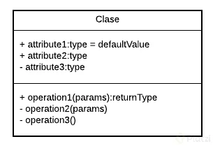
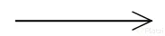
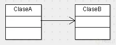
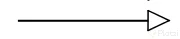
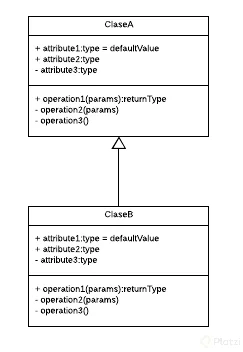
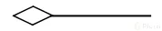
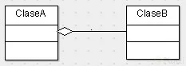
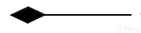
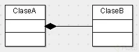

# Paradigma de programación POO
- Surge a partir de problemas que debemos plasmar en código
- Observamos los problemas en forma de **Objetos**
- La POO es un paradigma de programación 
> **Paradigma es la teoría que suministra la base y modelo para resolver problemas**
- POO es una forma de pensar para resolver problemas orientádos en los objetos

**4 Elementos**
- Clases
> Podemos definir una **clase** como un _molde_ para crear **objetos** en donde definimos dos cosas muy
> importantes: **atributos** que son las propiedades que definen a la clase y los **métodos** que son las acciones
> que puede realizar la clase
- Propiedades
- Métodos Objetos

**4 Pilares**
- Encapsulamiento 
- Abstracción 
- Herencia
- Polimorfismo 

# Diagramas de Modelado

Nos permiten plasmar de forma gráfica a través de diagramas nuestro análisis. Servirá de intermediario para poder entender el problema 
y la solución con la orientación a objetos.

**Existen dos herramientas de diagramación:**
- **OMT** (Object Modeling Techniques)
> Metodología que se basa estrictamente en identificar los objetos, sus métodos, sus atributos y cuales son las relaciones que tienen.
> Pero ya está descontinuada.

- **UML** (Unified Modeling Languaje)
> Toma todas las bases y técnicas del OMT, las unifica y permite una ampliación de apicaciones, no solo objetos y clases.
> Sino que incluye casos de uso, actividades, iteración, estados e implementación.

**IMPORTANTE:** Un buen desarrollador debe manejar y dominar con fluidez, conceptos de UML ya que es lo que nos van a entregar cuando empecemos a trabajar
en un proyecto que se haya construido bajo la arquitectura POO.

> Adaptación del comentario de Manuel Mosquera Student Platzi

# ¿Cómo representar los objetos en UML? 

- Las **clases** se representan así: 


> En la parte superior se colocan los atributos o propiedades, y debajo las operaciones de la clase.
> **Notaras que el primer caracter con el que empiezan es un símbolo.** ESTE DENOTARA LA VISIBILIDAD DEL ATRIBUTO O MÉTODO. _Esto es un término que tiene que ver con ENCAPSULAMIENTO_.
> Estos son los niveles de **visibilidad** que puedes tener: 

>> **-** = Private

>> **+** = Public

>> **#** = Protected

>> **~** = default

- Una forma de representar las **relaciones** que tendrá un elemento con otro es a través de las flechas en UML, 
- hay varios tipos peor estos son los más comunes: 

## **Asociación**



> Como su nombre lo dice, notarás que cada vez que esté referenciada este tipo de flecha significará que **ese elemento 
> contiene al otro en su definición**. _La flecha apuntará hacía la dependencia._ 



## **Herencia**



> Siempre que veamos este tipo de flecha se estará expresando la herencia.
> **La dirección de la flecha irá desde el hijo hasta el padre**



> Con esto vemos que la ClaseB hereda de la ClaseA

## **Agregación**



> _Este se parece a la asociación en que un elemento dependerá del otro_, pero en este caso 
> será: **Un elemento dependerá de muchos otros**. Aquí tomamos como referencia la multiplicidad del elemento. Lo que comúnmente
> conocerías en Bases de Datos como **_Relaciones uno a muchos_**



> Con esto decimos que la ClaseA contiene varios elementos de la ClaseB. Estos últimos son comúnmente representados con listas o colecciones de datos

## **Composición**



> _Este es similar al anterior_ solo que su relación es totalmente compenetrada de tal modo 
> que conceptualmente una de estas clases no podría vivir si no existiara la otra



# Objetos

**¿Cómo identificar los objetos en el problema?**

- Objetos son aquellos que tienen propiedades y comportamiento 
- Pueden ser **Físicos** o **Conceptuales**
- Son sustantivos
- Propiedades también pueden llamarse atributos, serán sustantivos 
- Comportamientos, serán todas las operaciones del objeto, suelen ser verbos o sustantivos y verbos

# Abstracción y clases

- Clase: Es el modelo sobre el cual se construirá nuestro objeto -> Y las clases me permitirán generar más objetos
> El paso intermedio, estudiar el objeto para modelarlo se conoce como **abstracción**

# Modularidad 

> Modular: Dividir un sistema y así crear módulos independientes.

Ventajas: 
- Reutilizar
- Evitar colapsos
- Mantenible
- Legibilidad
- Resolución rápida de problemas

Y las _Clases_ justamente nos permiten: Modularidad, Dividen el programa en diferentes aprtes o módulos/clases, Separar las clases en archivos

## Proceso para hacer orientación a objetos
Supongamos que tenemos un problema, el de adoptar un perrito, siguiendo nuestro proceso, serái de la siguiente manera: 

- **Identificar el problema:** Adoptar una masctoa, un perro en este caso
- **Identificar los objetos:** Fundación, Persona, Mascota(en este caso solo perros), Adopción, Donación, Voluntariado y historia “clinica” de la mascota
- **Definir las clases:** Las clases en este caso corresponden a los objetos identificados pero algo a tener siempre en cuenta es que, **cuando 
estás definiendo los atributos de cada objeto y te encuentras con redundancía, lo más probable es que tengas que hacer una abstracción**
> **DRY:** Don't repeat yourself
> > Promueve la reducción de duplicación en programación 
> > Toda pieza de información **nunca debería ser duplicada** debido a que la duplicación **incrementa la dificultad** en los cambios y evolución 
- **Plasmarlas en UML**
- **Codear**

# Método constructor 

- Dar un estado inicial al objeto 
- Tiene el mismo nombre de la clase
- Son los parámetros mínimos que necesita el objeto para que pueda vivir 

# Declarando un método constructor en Python 

En Python encontrarás un concepto denominado **Métodos Mágicos**, estos métodos son llamados automática y estrictamente bajo ciertas reglas.
El método constructor en Python forma parte de esta familia de métodos y como aprendimos en la clase anterior lo declaramos usando __init__,
aunque si nos ponemos estrictos este método no construye el objeto en sí. El encargado de hacer esto es __new__ y el método __init__ 
se encargará de personalizar la instanciación de la clase, esto significa que lo que esté dentro de __init__ será lo primero que se ejecute
cuando se cree un objeto de esta clase.
- Ejemplo 

```python 
class Account: 
  id = int
  name = str
  document = str
  email = str
  password = str
  
  def __init__(self, name, document): 
    self.name = name 
    self.document = document 
    
# Aquí es otro archivo 
from account import Account

class Car: 
  id = int
  license = str
  driver = Account("","")
  passenger = int
  
  def __init__(self, license, driver): 
    self.license = license
    self.driver = drive 
    
    
# Main.py
from car import Car
from account import Account

if __name__="__main__":
  car = Car("AMS234", Account("Andres H", "ANDA876"))
  print(vars(car))
  print(vars(car.driver))
  
  >> {'driver': <account.Account instance at 0x104iudsa>, 'license': 'AMS234'}
  >> {'document': 'ANDA876', 'name': 'Andres H'}
```

# Aplicando herencia en Python 
- Ejemplo
```python
from car import Car

class UberX(Car): 
  brand = str
  model = str
  
  def __init__(self, license, driver, brand, model): 
    super.__init__(license, driver) 
    self.brand = brand
    self.model = model 
```

Notemos que estamos usando **super.__init__(license, driver)**
pero también podriamos hacer: 
```python 
def __init__(self, license, driver, brand, model): 
    Car.__init__(license, driver) 
    self.brand = brand
    self.model = model
```
Pero se recomienda hacer uso de **super.__init__** ya que de esta forma, si bien es casi el mismo código, no necesitamos especificar la clase padre,
por lo que podremos cambiarle el nombre en cualquier momento y nuestro código seguirá funcional. 
