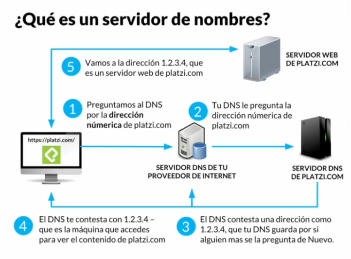
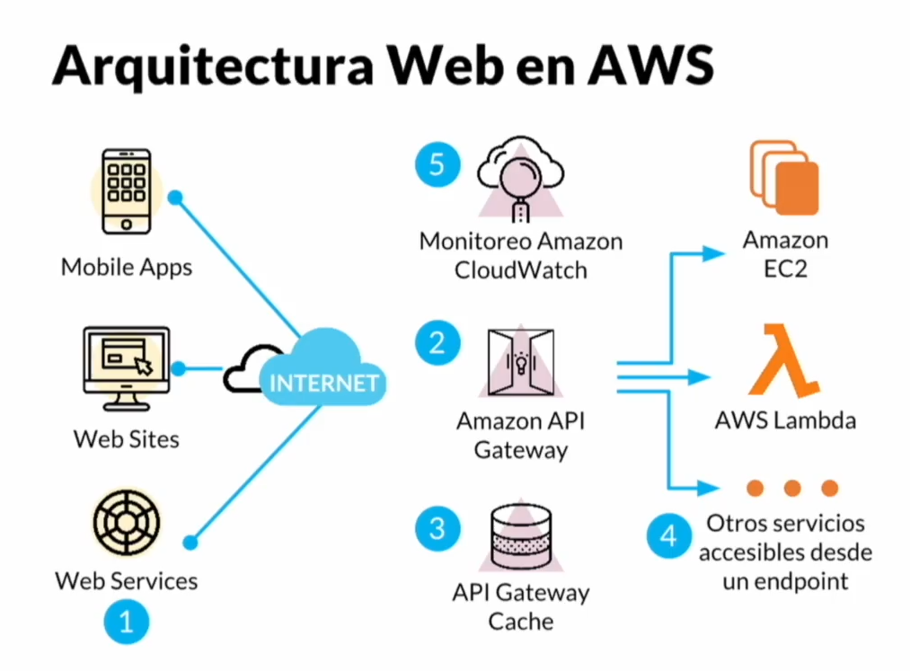
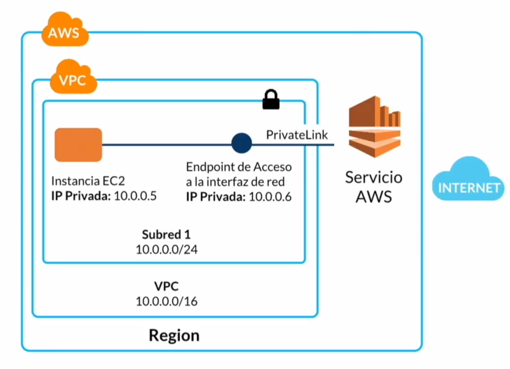
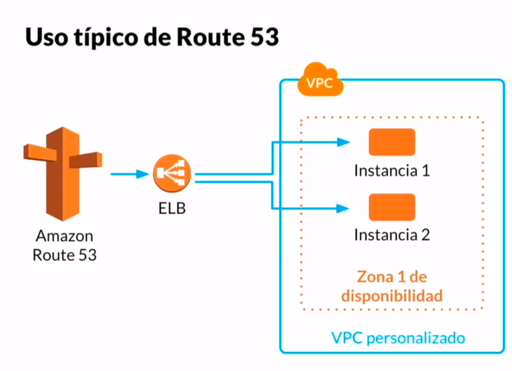

# ¿Qué es networking & CDN en AWS? 

AWS contiene muchos servicios. Entre ellos, tenemos funciones
de optimización al nivel de red, ya sea para hacer más eficiente
el distribuir contenido o hacer más seguro tus servicios publicados 
en la nube de amazon. 

### **Componentes de AWS Networking & CDN**
- **VPC:** Red privada virtual en AWS
- **CloudFront:** Acelerador de entrega de contenido web.
- **Route 53:** Servidor de nombres (DNS) en AWS.
- **API Gateway:** Una dirección pública que conecta con el servicio backend interno.

# ¿Qué es un servidor de nombres? 
Dado que la Internet no conoce de nombres, se hace uso de un DNS.
**DNS** Es el nombre que recibe el sistema de nombres de dominio
(DNS, por sus siglas en inglés, Domain Name System) 
que se trata de un sistema de nomenclatura jerárquico
descentralizado para dispositivos conectados a redes IP como Internet
o una red privada.

Grosso modo lo que realiza este sistema es la asociación de información variada
con nombre de dominio asignado a cada uno de los participantes. 
Su función más importante es “traducir” nombres inteligibles para las personas
en identificadores binarios asociados con los equipos conectados a la red,
esto con el propósito de poder localizar y direccionar estos equipos mundialmente.

> **El servidor DNS utiliza una base de datos distribuida y jerárquica que almacena
información asociada a nombres de dominio en redes como Internet.**

Ejemplos:
- platzi.com: 104.20.54.150
- google.com: 172.217.19.206

DNS se encargará de traducir la dirección IP a el nombre.

> Imagen obtenida de la clase número 3 del curso práctico de Networking y
> Content Delivery en AWS de Platzi, para fines no lucrativos. 

# ¿Qué es un CDN? (O red de distribución de contenido)

- **CDN:** Es una red de servidores en el mundo con copias de tu sitio favorito, para que cargue más rápido en
 tu dispositivo de cómputo. **Es una red superpuesta de computadoras que contienen copias de archivos**, colocados en
 varios puntos de una red con el fin de maximizar el ancho de banda para el acceso a los datos de clientes por
 la red.
- **Tipos de archivos:** HTML, CSS, JS, Imágenes, entro otros (prácticamente cualquier cosa que se pueda servir en un
servidor web)
- **CloudFront:** Es un CDN, es decir, CloudFront pone tus archivos en varios servidores en el mundo.
  Es un servicio rápido de red de entrega de contenido (CDN) que distribuye a clientes globalmente datos, vídeos,
  aplicaciones y API de forma segura, con baja latencia, altas velocidades de transferencia y dentro de un entorno
  fácil para desarrolladores.
  
  
# ¿Qué es un endpoint? 
Es un punto de contacto entre tu servicio web y el internet. Podemos pensarlo como una 
dirección pública de Internet donde puede llegar una app móvil, un sitio web o un sistema de APIS para
preguntar algo al servidor.

### ¿Por qué un concepto nuevo? 
Piensa un endpoint como una dirección genérica que puedes resolver con distintos criterios, como por ejemplo: 
enviar a distintas versiones de tu servicio. 

> Puedes administrar diferentes versiones de tu API, sitio web, etc especificando argumentos en tu llamada a la
> dirección de tu sitio web. 

# Arquitectura Web en AWS

A grandes rasgos tenemos estos tres grupos de componentes 

> Imagen que muestra grosso modo tres grupos de una arquitectura en aws, créditos para Platzi

1. **Los usuarios o los clientes:** Pueden ser mediante dispositivos móviles, sitios web, servicios web, apis o
 microservicios. En este nivel se hacen peticiones al servidor para tener imágenes o vídeos, textos, páginas, etc.
 Esta información viaja através de internet y se hace todo el proceso de DNS y el resultado de esta consulta 
 se va a los endpoints. Que es el segundo grupo en la imagen. 
2. **Un endpoint:** en Amazon puede ser una API Gateway, que es un lugar público a lque te puedes conectar 
desde puertos HTTP o HTTPS y pedir contenido. Internamente esta información se va a un dispositivo de cómputo o 
servidor dentro de Amazon como instancias EC2, funciones Lambda, etc. Que son el tercer grupo de la imagen. 
> Puedes tener varios endpoints dependiendo de los servicos que requieras. 

En Amazon puedes monitorear tus datos o servidores usando el servicio de **CloudWatch** que anota todos los
movimientos de archivos, reportando si algo falla o sale bien. 
CloudWatch también tiene mecanismos de caché, ahorrando llamadas al servidor.

# ¿Qué es VPC? (Teoría)

- **VPC Virtual Private Cloud:** Es una nube privada dentro de la gran nube de Amazon y ahí puedes hacer lo que
 quieras, como poner servidores, bases de datos y otros. Puedes hacer interactuar tus servidores dentro de la
 misma VPC o exponerlos hacia internet.

**El contenido en tu VPC tendrá dos IPs**. _Una privada interna_ y la otra es _una pública_ que es la IP por la
cual alguien externo puede visualizar el contenido. También puedes configurar protocolos de seguridad para hacer
tus IP públicas sólo en ciertos puertos, usando Amazon para configurarlo.

### Un VPC funciona así:
Tienes por un lado cualquier dispositivo conectado a internet, el cual se conecta a la red de AWS y a su vez
dentro de esta red, viven diferentes VPC (Puedes tener varias VPC en tu cuenta)

**Importancia de un VPC:**
- Se pueden asignar IPs estáticas “internas” de manera gratuita.
- Se puede asignar una dirección IPv6 tanto al VPC como a instancias, aunque la más usada es la versión IPv4.
- Se puede asignar múltiples IPs a una instancia, con la posibilidad de comprar por un bajo precio una IP
 elástica (siempre será la misma)
- Cambiar los grupos de seguridad en vivo.
- Control fino sobre el tráfico saliente
- Controles de seguridad extras a nivel de red (ACLs)

> Imagen que muestra grosso modo una vpc en Amazon, créditos para Platzi

### - Implementar VPC tutorial

# ¿Qué es CloudFront?

**CloudFront es la implementación de CDN de AWS.**

Una CDN es una red de distribución de contenido que crea réplicas del archivo en diferentes partes del mundo, dependiendo de tus necesidades
y las áreas geográficas que debes cubrir. CloudFront tiene diferentes centros de replicación intentando cubrir gran parte del globo.
Para América del Sur, tenemos un centro en Brazil. Tiene como característica que se sincronizan rápidamente.

En el caso de un archivo de video, funcionaría de la siguiente manera: 

- El archivo es enviado a un Storage S3 y pasaría a un conversor de archivos AWS Elemental MediaConvert que crearía copias del archivo
con diferentes tamaños y calidades. 
- Después de ésto, se notifica a CloudWatch que redirecciona de nuevo a los Amazon S3 en las diferentes locaciones.

El tener diferentes archivos es muy útil porque dependiendo de la conexión y dispositivo del cliente, Amazon enviará la respuesta de archivo
adecuada para que el streaming nunca se entrecorte.

**Características de CloudFront:**

- No hay contratos, no hay pagos por adelantado. Te cobran por lo que se consumió.
- Es fácil de administrar ya que puedes simularlo con instancias EC2 en distintas regiones lo cual implica un desarrollo completo.
- Se soporta cualquier tipo de archivo que pueda ser compartido por un servidor web.
- CloudFront garantiza ciertos niveles de calidad en la distribución de contenido.
- Es muy seguro ya que el contenido va sobre HTTPS.
- Podrías enviar código lambda para que puedas tener cierto código dinámico en cualquier parte del mundo.

# Route 53

Route 53 es el servicio de Amazon de nombres de dominios donde puedes no solo configurar los dominios que ya tengas, sino comprar, 
crear subdominios, cambiar un dominio a diferentes implementaciones, entre otras opciones disponibles.

Funciona así: Cuando tienes un nombre de dominio o subdominio, éste apunta a algún endpoint de Amazon como un balanceador de carga y de ahí
irá a algún proyecto específico como EC2 o un contenido HTTP.

**Usos de Route 53**

- Servidor de nombres.
- Registro de dominios con precios competitivos para el mercado.
- Alta disponibilidad en dominios, teniendo servidores con pesos, definiendo cuál es tu servidor principal y dándole prioridad a éste.
- También puedes decidir a qué servidor dirigir a un usuario dependiendo de su localización.

> Imagen que muestra como funcionaria normalmente un redireccionamiento en route 53, créditos para Platzi

**Alta disponibilidad en dominios**
Se puede configurar un failover o una alternativa en caso de que el servidor principal no esté funcionando.

- **Prioridad:** Funciona a través de tener records con pesos. Es decir, se puede decidir en el DNS cuál es el servidor principal
(peso o prioridad mayor) y cuáles son los servidores alternativos. Esto con el fin de que el navegador del usuario, a través de la
configuración del DNS, decida a qué servidor ir tomando como variable la disponibilidad de los mismos.

- **Latencia:** Dependiendo de la ubicación de los distintos servidores que se tengan alrededor del mundo, y de la ubicación del
 usuario que esté solicitando servicio de los servidores, se le redireccionará al servidor con menor latencia.
 
### Cosas que debes tener en cuenta al momento de configurar un dominio 
- La primera vez que registres un dominio en Amazon, va a tardar bastante, así que planea con anticipación.
- La primera entrada en nuestro dominio NS es la que necesita Amazon para decirle a internet que él es el servidor de dominio 
para ese dominio en particular.
- La entrada SOA es un registro de revisión de servicio.
- La entrada A son nuestros subdominios o dominios que creamos.
- Cuando creamos un subdominio tenemos varias opciones en Type; las más usadas son IPv4 que significa que pondremos la dirección IP del dominio
 y CNAME es el alias de Amazon de nuestro recurso.

# API Gateway

**Un API Gateway es un endpoint público abierto a internet que recibe peticiones de tipo HTTP.**
Si se pide algún contenido que anteriormente se haya resuelto, se regresará la versión disponible en caché;
sino se conectará con algún sistema como una instancia EC2, lambda, etc.
Cuando algo no está en caché el API Gateway lo notará y redireccionará a través de Route 53 llevando a diferentes servicios como
funciones lambda, servidores EC2 o elastic beanstalk.

### **Existen diferentes arquitecturas para un API Gateway:**

- Tenemos un cliente web que se conecta a la API Gateway de Amazon lo cual podría ir a un Load Balancer dependiendo de tu configuración y
 por último llegaríamos a la infraestructura de Docker.
- El usuario estando en su dispositivo o una API, realiza la petición al API Gateway (si existe en caché se regresa directamente al usuario), 
envía a una función lambda que procesa lo que deba procesar y por último ésta se conecta con una base de datos. Una vez se tiene la información, 
se regresa al API Gateway y por último al usuario.
- El usuario pide todo el contenido estático a Amazon S3, sin embargo si es algo dinámico, se pide al API Gateway, que va a lambda finalmente
 consultando a la base de datos.
 
**APIGateway se puede conectar a cualquier recurso de computo, esto puede ser: Elastic Beanstalk, Funciones Lambda, Instancias EC2, Buckets s3
que sirve web todo el tiempo, enre otros**

# **Pasos para crear un API Gateway con Lambda**

1. En la barra de búsqueda escribimos "Lambda" para buscar el servicio 
2. Entramos al servicio "Lambda"
3. Presionamos en "Create function"
4. Seleccionamos "Author from scratch"
5. Le damos un nombre 
6. Seleccionamos el lenguaje con el que la vamos a programar 
> Por ahora es todo, la demás configuración se deja por defecto
7. Presionamos en "Create function"

Observamos que una vez que la función es creada, debemos de añadir un trigger. 
Para ello seleccionamos:

8. Add trigger: API Gateway
Nos pedira una configuración, seleccionamos: 
9. Create a new API
10. Rest API
11. Security: Open

> Listo, ya tienes la función lambda y su respectivo trigger creado, podrás incluso abrir el endpoint de API Gateway y 
> ver una respuesta del tipo: "Hello from Lambda" 

