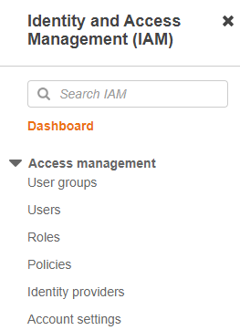
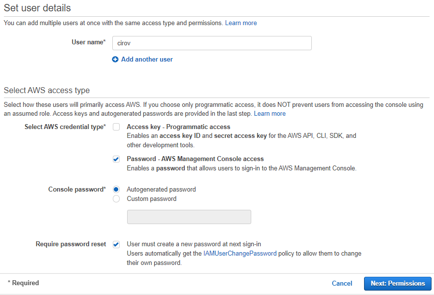
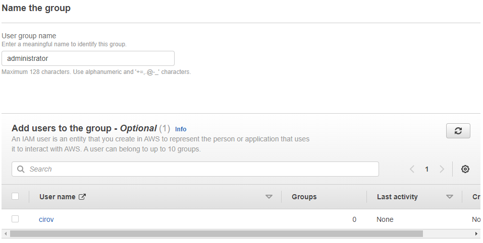
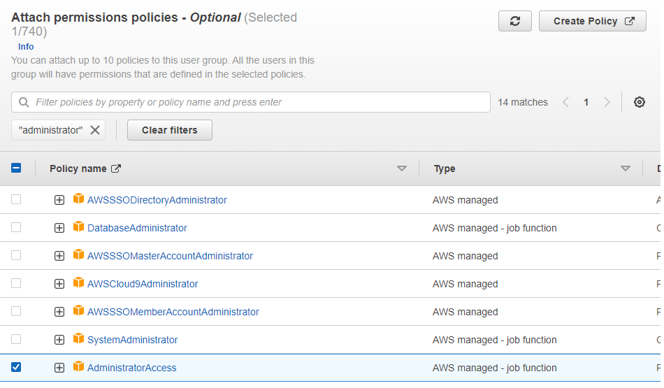
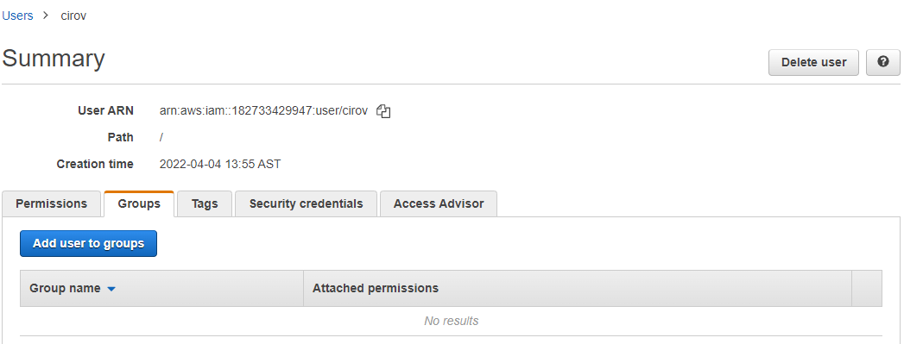

# Visión general de las TI tradicionales

### La web en términos simples

Tenemos un **cliente** con una dirección IP que se conecta a una **red** 
para hacer una **petición** a un **servidor** con otra dirección IP. Este servidor
devuelve una respuesta al cliente. 

### ¿Cómo está compuesto un servidor?

Un servidor posee los siguientes  componentes: 

- **Cómputo/CPU:** Realiza las operaciones que necesitamos
- **Memoría RAM:** Contiene la información a procesar mediante
  la CPU. Es como un cerebro
- **Almacenamiento:** Archiva datos, a modo de archivos de texto plano 
- **Bases de datos:** Información almacenada de manera estructurada
- **Redes**: Cables, routers y servidores conectados unos a otros. Servidores DNS

### Terminología de IT (redes) 

En terminos generales, un cliente envía un paquete a un **router**, el cual 
reenvía este paquete al **switch** y este se encarga de distribuirlo. 

- **Router:** Dispositivo que reenvía paquetes de datos entre redes informáticas
- **Switch:** Dispositivo que toma paquetes y los envía al servidor/cliente correcto
  en la red
  
 
### Diseño tradicional de infraestructura 

Las grandes empresas de IT empezaron comprando servidores y montándoloes en sus garajes. 
Se encontraron con problemas al tratar de expandir la infraestructura. Costos de movimiento, 
comprar nuevos equipos, etc etc. 

### Problemas del enfoque de IT tradcional 

- **Renta:** Los costos de rentar espacios para mantener servidores son altos
- **Mantenimiento:** El funcionamiento de los servidores es dificil de asegurar
- **Reemplazar y agregar hardware:** Pueden existir largos tiempos de espera para 
  conseguir el hardware necesario
- **Escalamiento limitado:** Podemos vernos limitados por el espacio donde almacenamos 
  los servidores
- **Monitoreo 24/7:** Debemos contratar gente para monitorear los servidores
- **Desastres naturales:** ¿Cómo evitamos que se caigan nuestros servicios si ocurre un
  imprevisto?**
  
  > Resumen realizado gracias a Jesús Ignacio García Fernández & Ciro Villafraz

# ¿Qué es la computación en la nube?

La computación en la nube es la entrega bajo demanda de recursos de IT como computación,
almacenamiento y otros servicios a través de internet. En pocas palabras, es como si
alquiláramos la computadora de otra persona.

Esta tecnología permite acceso instantáneo a los recursos que necesites, así como la
adquisición del tipo y tamaño exacto de estos recursos. Algunos servicios que seguramente
has usado son Gmail (proveedor de email), Dropbox (proveedor de almacenamiento)
y Netflix (proveedor de video bajo demanda).

### Modelos de computación en la nube

**Nube pública**

La nube pública se refiere a los recursos de proveedores que utilizamos a través de
internet y algunos ejemplos son Google Cloud Platform (GCP), Azure y AWS.

Además, posee estas ventajas:

- Elimina los gastos de capital comercial (CapEx) y reduce el gasto operativo (OpEx)
- Reduce los precios en economías de escala
- Despliega aplicaciones a nivel global en cuestión de minutos

**Nube privada**

La nube privada es un servicio empleado por una organización que no está abierto al público.
Permite un control total de la infraestructura y es útil para aplicaciones con requerimientos
específicos de seguridad o comerciales.

**Nube híbrida**

La nube híbrida consiste en mantener nuestra infraestructura y extender sus capacidades mediante
la nube pública. Posibilita el control sobre activos sensibles en tu infraestructura privada,
aprovechando la flexibilidad y rentabilidad de la nube pública.

**Características de la computación en la nube**

Ahora que conoces los distintos modelos de tecnología en la nube, es importante hablar
sobre sus propiedades de computación.

- Este modelo genera un autoservicio en demanda (con registros en la plataforma ya se pueden proveer recursos)
-Tiene un amplio acceso a la red
- Proporciona un espacio donde los clientes pueden compartir infraestructura y recursos de manera segura

**Problemas resueltos por la nube**

Por último, es crucial que conozcas las cualidades que trae implementar un sistema de computación en la nube.

- La nube aporta flexibilidad (puedes cambiar los tipos de recursos cuando sea necesario)
- Brinda rentabilidad y un servicio medido pues pagas solo por lo que usas
- Trae escalabilidad al agregar capacidad para hardware o equipos que necesitan acomodar cargas grandes
- Ofrece elasticidad al dar capacidad de escalar automáticamente cuando sea necesario
- Tiene alta disponibilidad y tolerancia a fallos
- Proporciona agilidad (puedes desarrollar, probar y ejecutar rápidamente aplicaciones en la nube)

> Resumen realizado gracias a Jesús Ignacio García Fernández & Ciro Villafraz

# Tipos de cómputo en la nube (IaaS, PaaS, SaaS)

- IaaS: Infraestructura como Servicio
- PaaS: Plataforma como Servicio 
- SaaS: Software como Servicio 

Estos modelos varían de acuerdo al tipo de servicio informático que
pueda ofrecer, como servidores, almacenamiento, software o bases de datos.

### Infraestrcuture as a Service (IaaS)

La infraestructura como servicio (IaaS) proporciona componentes básicos de IT en la nube, es decir,
redes, computación, almacenamiento, etc. A su vez, provee el máximo nivel de flexibilidad para
adaptarlo a tus necesidades.

Ejemplos:

- Azure Virtual Machines
- Linode
- Digital ocean
- S2 AWS

### Platform as a Service (PaaS)

Los modelos que ofrecen una plataforma como servicio (PaaS) eliminan la necesidad
de que administremos la infraestructura y proveen una plataforma para gestionar
aplicaciones.

Ejemplos:

- Heroku
- Google App Engine
- AWS Elastic Beanstalk

### Software as a Service (SaaS)

El Software como servicio (SaaS) brinda un producto de software terminado que es
ejecutado y administrado por el proveedor del servicio.

Ejemplos:

- Amazon Rekognition
- Dropbox
- Zoom
- Gmail

### On -premises

On-premises se refiere a una forma tradicional de cómputo en la cual nos encargamos de
gestionar nuestra propia infraestructura.

### Responsabilidades según el tipo de cómputo

En la siguiente tabla se muestra qué componentes de IT están administrados según el tipo de
cómputo en la nube. “Sí” indica que el componente está administrado por el proveedor de nube,
“No” indica que nosotros somos responsables del componente.

| Componente | On-premises | IaaS | PaaS | SaaS |
| --- | --- | --- | --- | --- |
| Aplicaciones	| No | No | No |	Sí |
| Data | No |	No |	No |	Sí |
| Runtime |	No |	No |	Sí |	Sí |
| Middleware |	No |	No |	Sí |	Sí |
| O/S |	No |	No |	Sí |	Sí |
| Virtualización |	No |	Sí |	Sí |	Sí |
| Servidores |	No |	Sí |	Sí |	Sí |
| Almacenamiento |	No |	Sí |	Sí |	Sí |
| Redes |	No |	Sí |	Sí |	Sí |

> Resumen realizado gracias a Jesús Ignacio García Fernández & Ciro Villafraz

# Una visión global :regiones y zonas de disponibilidad 

La infraestructura de AWS está compuesta por regiones, zonas de disponibilidad, data centers y puntos de presencia.
Además, se distribuye en diferentes regiones alrededor del mundo. Algunas de ellas son Ohio, Oregon, Norte de California,
e incluso lugares exclusivos del gobierno de EE. UU. como GovCloud Este.

### ¿Cómo escoger una región de AWS? 

Podemos escoger la región de nuestra aplicación basada en distintos aspectos que mencionaremos a continuación.

Por ejemplo:

- El cumplimiento de los requisitos legales y de gobernanza de datos, pues los datos nunca abandonan una región sin su permiso explícito

- La proximidad con los clientes porque lanzan en una región cercana en donde estén para reducir latencia. 
> Puedes revisar esta característica desde tu ubicación a cada región en **cloudping.info**

- Los servicios disponibles dentro de una región debido a que muchos no funcionan en todas partes.

Algunos servicios globales o regionales son:

- **Globales**
- - IAM
- - Route 53
- - Cloudfront
- - WAF

- **Regionales**
- - EC2
- - Beanstalk
- - Lambda
- - Rekognition

> https://aws.amazon.com/es/about-aws/global-infrastructure/regional-product-services/

Los precios varían de región a región y son transparentes en la página de precios del servicio.

### Zonas de disponibilidad

Una zona de disponibilidad es un grupo de data centers donde cada uno está lleno de servidores.
Estos data centers poseen energía, redes y conectividad redundante, están separados entre sí, 
conectados con un gran ancho de banda y redes de latencia ultra baja.

### Modelo de responsabilidad compartida

Ahora es crucial determinar las responsabilidades de AWS y del cliente dentro del servicio tecnológico que ofrece la compañía.

**AWS se hace responsable de:**

- Hardware y la infraestructura global
- Regiones
- Zonas de disponibilidad
- Ubicaciones de AWS Edge / puntos de presencia
- Software
- Cómputo
- Almacenamiento
- Bases de datos
- Redes

**El cliente se responsabiliza de:**

- Actualizaciones de S.O.
- Protección de los datos que se almacenan
- Manejo de aplicaciones
- Accesos
- Administración de usuarios y grupos

> Resumen realizado gracias a Jesús Ignacio García Fernández & Ciro Villafraz

# Seguridad e identidad

### Servicios de protección de datos

A continuación, conocerás algunos servicios de protección de AWS y sus funciones para mover 
nuestras plataformas en la nube:

- **Amazon Macie:** descubre y protege datos sensibles
- **AWS Key Management Service:** almacena y administra claves de cifrado
- **AWS CloudHSM:** proporciona almacenamiento de claves basado en hardware
- **AWS Certificate Manager:** provee, administra e implementa certificados SSL/TLS
- **AWS Secrets Manager:** traslada, gestiona y recupera datos (contraseñas, por ejemplo)

### Servicios de protección de la infraestructura

Es fundamental que cuides de la infraestructura de tu sitio web y AWS ofrece los siguientes servicios de seguridad:

- **AWS Shield:** protege contra ataques de Denegación de Servicio (DDOS)
- **AWS Web Aplication Firewall (WAF):** filtra el tráfico de sitios web maliciosos
- **AWS Firewall Manager:** administra las reglas del firewall de forma centralizada

### Servicios de detección de amenazas

En todo momento nuestra plataforma está expuesta a grandes amenazas y por eso AWS desarrolló los siguientes servicios:

- **Amazon GuarDuty:** detecta automáticamente las amenazas
- **Amazon Inspector:** analiza la seguridad de la aplicación
- **Amazon Config:** registra y evalúa configuraciones de nuestros recursos
- **Amazon CloudTrail:** rastrea la actividad del usuario y el uso de las API que ocupamos en nuestra cuenta.

### Servicios de gestión de identidad

Por último, existen distintas herramientas de gestión de identidad que provee AWS:

- **AWS Identity and Access Management (IAM):** administra de forma segura el acceso a una cuenta, servicios y recursos
- **AWS Inicio de sesión único:** implementa el inicio de sesión único (Single Sign On/SSO)
- **Amazon Cognito:** permite a los usuarios administrar la identidad dentro de las aplicaciones
- **AWS Servicio de Directorio:** implementa y administra un Active Directory service
- **AWS Organizaciones:** funciona para gobernar y administrar de distintas cuentas de AWS de forma centralizada

> Resumen realizado gracias a Jesús Ignacio García Fernández & Ciro Villafraz

# IAM ilustrado 

Identity and Access Management (IAM) es un servicio gratuito que nos ayuda a administrar los accesos a los
servicios y recursos de tu cuenta en AWS. A su vez, puedes crear usuarios, grupos y establecer permisos
de acceso a los recursos mediante el uso de políticas.

### Usuarios y grupos de usuarios de IAM

Los usuarios y grupos de usuarios son de los principales componentes de IAM. 
Al crear tu cuenta de AWS te proporcionan un usuario Root que tiene acceso a todos los recursos,

Este usuario puede generar otros perfiles y cada uno con un acceso único a distintos recursos de AWS. 
Además, Root también puede configurar grupos de usuarios, donde cada miembro tiene y puede compartir permisos de acceso.


### Ejemplos de políticas de IAM 

El acceso a recursos se otorga mediante políticas. 

> Este es un ejemplo de una política que otorga acceso de administrador. 
```JSON
{
    "Version": "2012-10-17",
    "Statement": [
        {
            "Effect": "Allow",
            "Action": "*",
            "Resource": "*"
        }
    ]
}
```
> También está este ejemplo de políticas de acceso a un bucket de S3 (almacenamiento)
```JSON
{
    "Version": "2012-10-17",
    "Statement": [
        {
            "Effect": "Allow",
            "Action": [
                "s3: ListBucket"
            ],
            "Resource": "arn:aws:53 ::: bucket-name"
        },
        {
            "Effect": "Allow",
            "Action": [
                "s3: GetObject",
                "s3: PutObject",
            ],
            "Resource": "arn:aws:53 ::: bucket-name/*"
        }
    ]
}

```

### IAM Roles

Además de todas estas funciones, IAM de AWS permite asumir roles y otorgar permisos a otras tecnologías.
Por ejemplo, podemos conceder a una máquina virtual el acceso a una base de datos mediante un rol de IAM.

> Resumen realizado gracias a Ciro Villafraz

# Secrets Manager

Secrets Manager es un servicio de AWS que nos ayuda a proteger los datos secretos (contraseñas, claves y tokens)
necesarios para acceder a nuestras aplicaciones, servicios y recursos.

También nos permite compartir automáticamente esta información cuando queramos.
Además, este servicio evita que tengamos que copiar y pegar los secretos directamente en nuestro código.

> Resumen realizado gracias a Ciro Villafraz

# Demostración del servicio de directorio 

Un directorio es una base de datos que contiene información de inicio de sesión de todos los usuarios de una red y 
puede implementar políticas de seguridad.

Dado que Windows es el sistema operativo más usado a nivel mundial, Microsoft lanzó Active Directory.
Este servicio permite que las empresas gestionen los inicios de sesión de sus empleados.

### AWS Directory Service 

Es una oferta de servicio administrado de AWS que posibilita que sus recursos utilicen
Active Directory y ofrecen:

- Un directorio activo administrado sin tener que ejecutar servidores manualmente
- La opción de directorio activo simple
- El conector AD que brinda a usuarios inicio de sesión en aplicaciones de AWS con sus credenciales
- Un Servicio distribuido con error automático que funciona si hay fallas en los servidores
- El AWS Directory Service ss compatible con otros servicios de AWS

> Resumen realizado gracias a Ciro Villafraz

# Laboratorio: crea usuarios y grupos en AWS (TUTORIAL)

Para crear usuarios y grupos inicia sesión en la [consola de AWS](https://signin.aws.amazon.com/signin?redirect_uri=https%3A%2F%2Fconsole.aws.amazon.com%2Fconsole%2Fhome%3FhashArgs%3D%2523%26isauthcode%3Dtrue%26nc2%3Dh_ct%26src%3Dheader-signin%26state%3DhashArgsFromTB_us-east-2_b0f4e87742780639&client_id=arn%3Aaws%3Asignin%3A%3A%3Aconsole%2Fcanvas&forceMobileApp=0&code_challenge=oxldchJuzIZ9IemKqepD-HzVRATAFA8VV9SVjio15Zs&code_challenge_method=SHA-256).
En la barra de búsqueda, coloca “IAM” y haz clic en el primer resultado.

### **Crear un nuevo usuario**
A la izquierda verás un menú similar al siguiente: 


1. Haz clic en **"Users"** (o Usuarios). Allí vas a ver listados los usuarios
2. Luego haz clic en **"Add Users"** (o Agregar Usuarios) para añadir uno nuevo
3. A continuación, escribe el nombre de usuario y selecciona **"Passowrd - AWS Management Console Access"**, 
   **"Autogenerated Password"** y **"Require password reset"**
4. Haz clic en **"Next"** hasta llegar al paso 4 - Review

5. Finalmente, haz clic en **"Create user"**. No olvides guardar la contraseña generada al final


### Cómo crear un grupo de usuarios administradores

1. En el menú de la primera imagen, dirígete a **"User groups"** y haz clic en **"Create group"**
2. Escribe el nombre del grupo, "administrator" en este caso. Mira que en este menú puedes añadir 
usuarios allí, pero en este tutorial añadiremos el usuario al equipo después de su creación 


3. Más abajo encontramos la parte de las políticas de permisos. Aquí buscamos **“administrator”** y 
  revisamos el **“Administrator Access”** para asignarle permisos de administración al grupo.
  Hacemos clic en** “Create Group”** al finalizar.
  

### Cómo añadir el usuario al grupo de administrador 

1. Para esto es necesario que vuelvas a la sección de **"Users"**, luego haces clic en nuestro usuario, clic en la pestaña
  de Groups y en el botón de **"Add user to groups"**
  

Al final, simplemente escogemos los grupos a los que queremos añadir el usuario y hacemos clic en **"Add to Groups"**

> Resumen realizado gracias a Ciro Villafraz
