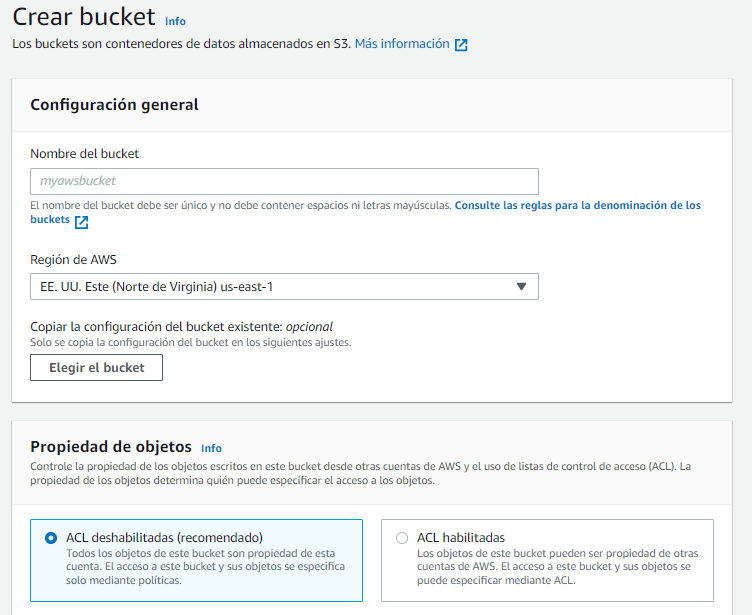
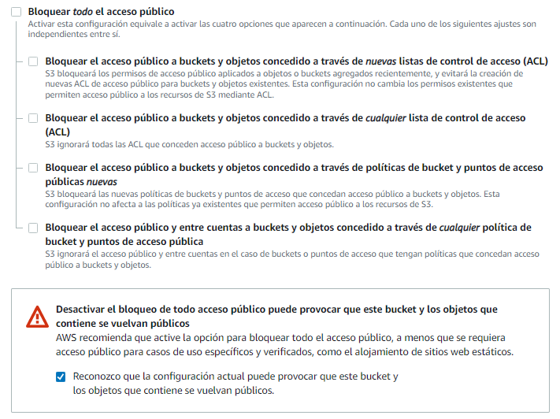
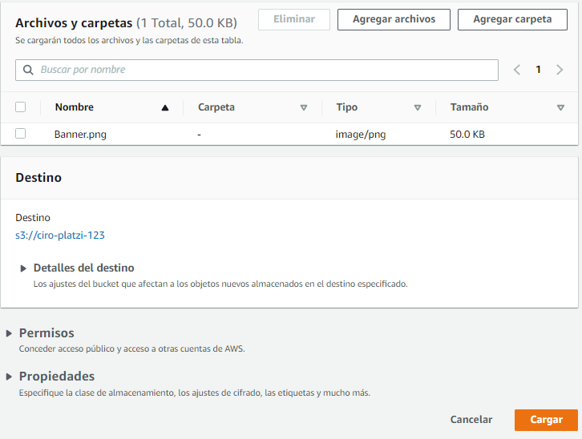
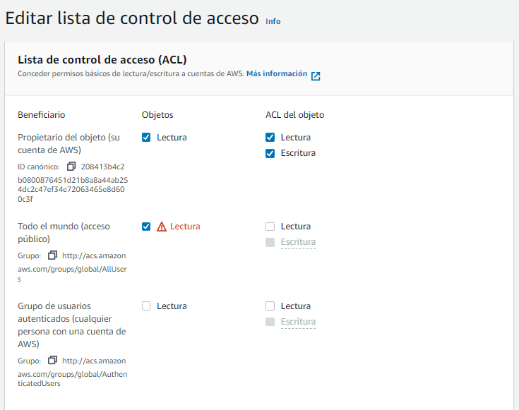
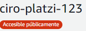

# Cómputo en AWS

### Instancias o máquinas virtuales
Una máquina virtual es un software que simula un sistema operativo, y que puede ejecutar programas 
dentro de dicho sistema como si fuera una computadora real.
Los servicios de máquinas virtuales (o instancias) en AWS son:

- **Amazon EC2:** máquinas virtuales seguras y redimensionables.
- **Amazon EC2 Spot:** cargas de trabajo tolerante a fallas, por hasta el 90% del precio normal
 (nota: Amazon puede reclamar estas instancias en cualquier momento con solo dos minutos de anticipación).
- **Amazon EC2 AutoScaling:** agrega o elimina automáticamente la capacidad informática para
 satisfacer tus necesidades bajo demanda.
- **Amazon EC2 LightSail:** plataforma en la nube fácil de usar para crear una aplicación o un sitio web.

### Contenedores
Un contenedor es una unidad de software que empaca un software en específico junto con sus dependencias.
Se diferencian de las máquinas virtuales en que estas virtualizan el hardware,
mientras que los contenedores virtualizan el sistema operativo.
Los servicios de contenedores de AWS son:

- **Amazon Elastic Container Services (ECS):** servicio para correr contenedores confiables y escalables.
- **Amazon Elastic Container Registry (ECR):** servicio para almacenar, administrar e implementar imágenes de contenedores.
- **Amazon Elastic Kubernetes Service (EKS):** servicio de Kubernetes administrado por AWS.

### Serverless
La computación **serverless** se refiere a que **la responsabilidad de administrar servidores
o máquinas virtuales se le delega al proveedor de nube**, por lo que sólo debemos precuparnos
por el código de nuestras aplicaciones. **Amazon Lambda** nos permite ejecutar piezas de código sin servidores.

### Servicios de borde (Edge)
El Edge Computing se refiere **al cómputo y procesamiento de datos en
una ubicación cercana a la necesaria para el negocio.** Los servicios de borde o edge computing de AWS son:

- **Amazon Outposts:** permite ejecutar los servicios de AWS en nuestros propios servidores en lugar de Amazon.
- **Amazon Snow Family:** es una familia de dispositivos desde un disco duro portátil hasta un semi-remolque
 completo lleno de discos de almacenamiento. Estos dispositivos te permiten cargar archivos en ellos,
 para luego ser enviados a Amazon y cargados en sus servidores.
- **AWS Wavelength:** permite acceder a los servicios AWS desde dispositivos 5G sin pasar por Internet.
- **VMWare AWS:** permite migrar cargas de trabajo de VMWare a AWS.
- **AWS Local Zones:** permite ejecutar las aplicaciones más cerca de los usuarios finales,
 a una menor latencia.


> Resumen realizado con los aportes de: Jesús Ignacio García Fernández, Eduardo Zamarron Muñoz y Ciro Villafraz.

# Amazon EC2
**EC2 permite alquilar máquinas virtuales, llamadas instancias EC2.** Puedes elegir diferentes tipos de EC2
con diferente CPU, RAM y almacenamiento. Hay instancias optimizadas para cómputo, memoria y almacenamiento, entre otras.

En EC2, el sistema de pago más común es por hora o por segundo, dependiendo el tipo de instancia.
Por ejemplo, para una instancia que cueste $0.1 la hora, puedes pagar, ya sea una instancia por 24 horas
o 24 instancias por una hora. En ambos casos pagas lo mismo (24 * 0.10 = $2.4).

### Opciones y precios bajo demanda
Las instancias pueden redimiensionarse. Puedes empezar por una instancia de bajo costo, y si necesitas aumenta su 
capacidad, apagas la instancia y seleccionas un nuevo tipo de instancia. Cuando enciendas de nuevo la
instancia, verás su capacidad aumentada.

La siguiente tabla muestra algunos tipos de instancias.


| Nombre	| Especificaciones |	Precio |
| --- | --- | --- |
| t3.nano |	2 vCPU’s, 0.5 GiB RAM |	$0,0052/hora |
| t3.xlarge |	4 vCPU’s, 16 GiB RAM |	$0,1664/hora |
| c6g.8xlarge	 | 32 vCPU’s, 64 GiB RAM |	$1,088/hora |
| X1e.xlarge	 | 128 vCPU’s, 3904 GiB RAM, 2x 1920 GB SSD |	$26,688/hora |

> Resumen realizado gracias a los aportes de Ciro Villafraz.

# Contenedores de Software

El propósito de un contenedor es **crear un paquete de tu programa y todas sus librerías y dependencias con 
las versiones específicas con las que has trabajado**, para producir una imagen que pueda ser
**ejecutada en cualquier máquina**.

Un problema común del desarrollo de software es utilizar distintas versiones de diferentes
librerías/lenguajes de programación/programas.
Docker nos permite crear contenedores para resolver este problema.

### Amazon ECS
Amazon ECS es un servicio de contenedores, donde puedes implementar tus imágenes en contenedores en AWS.
Cuando corras tus contenedores en AWS, no notarás diferencia entre tu máquina local y el entorno de AWS.


> Resumen realizado gracias a los aportes de Ciro Villafraz.

# AWS Lambda
AWS Lambda es un servicio **serverless** que nos permite **ejecutar código en respuesta a eventos, sin preocuparnos 
por servidores o infraestructura.** Estos eventos pueden ser temporizadores, visitas a alguna sección de nuestra aplicación, solicitudes HTTP, entre [otros](https://docs.aws.amazon.com/es_es/lambda/latest/dg/lambda-services.html#intro-core-components-event-sources).

Entre sus casos de uso encontramos el (pre)procesamiento de datos a escala, y la ejecución de backends web,
móviles y de IoT interactivos. Lambda se puede combinar con otros servicios de AWS para crear experiencias
en línea seguras, estables y escalables.

### ¿Cómo se factura Lambda?
Lambda se factura por milisegundos, y el precio depende del uso de RAM. Por ejemplo, 128MB RAM x 30 millones de
eventos por mes resultan en un costo de $11.63 al mes.

> Resumen realizado gracias a los aportes de Ciro Villafraz.

# Almacenamiento de datos en AWS

El almacenamiento de datos en la nube consiste en subir tus datos a dicha red de servidores,
donde se te proporcionan herramientas para que puedas acceder a ellos de diferentes maneras.

### Tipos de almacenamiento y sus servicios 
Podemos utilizar distintos tipos almacenamiento datos, y para estos hay servicios de AWS.
Los tipos de almacenamiento son:

- **Basado en archivos:** el más conocido por todos. Archivos organizados por carpetas y subcarpetas 
(sistema de ficheros). En esta categoría encontramos a **Amazon Elastic File System (EFS)** y
**Amazon FSx for Windows File Server**.

- **Bloque:** los archivos se almacenan en volúmenes por fragmentos de datos de igual tamaño, sin procesar.
 Este tipo de almacenamiento es utilizado como disco duro de nuestros servidores o máquinas virtuales.
 En esta categoría está **Amazon Elastic Block Store (EBS).**

- **Objetos:** la información almacenada se almacena como objetos, de manera que cada objeto recibe
 un identificador único y se almacena en un modelo de memoria plana.
 Un ejemplo de esto es **Amazon Simple Storage Service (S3)**.
 
### Respaldo de datos
**Amazon Backup administra y automatiza de forma centralizada** las copias de seguridad en los servicios de AWS.

### Servicios de transferencia de datos
¿Qué pasa si necesitamos transferir datos de nuestros servidores hacia AWS (o viceversa)?
AWS ofrece distintos servicios para la transferencia de datos.

- **AWS Storage Gateway:** un conjunto de servicios de almacenamiento en la nube híbrida que brinda
 acceso en las instalaciones al almacenamiento en la nube.
- **AWS DataSync:** acelera el traslado de datos desde y hacia AWS hasta diez veces más rápido de lo normal. 
- **AWS Transfer Family:** escala de forma segura tus transferencias recurrentes de archivos de Amazon S3
 y Amazon EFS con los protocolos FTP, SFTP y FTPS.
 
 > Resumen realizado gracias a los aportes de Jesús Ignacio García Fernández y Ciro Villafraz.
 
# S3 y S3 Glacier
Amazon S3 es un servicio de almacenamiento de objetos, líder en la industria.
Otorga una garantía de no pérdida de datos del 99.999999999% (11 9’s).

### Clases de almacenamiento en S3
Amazon nos ofrece distintas clase de almacenamiento S3 en función de nuestras necesidades de acceso y
disponibilidad de los datos.

- **S3 Standard:** almacenamiento de objetos de alta durabilidad, disponibilidad y rendimiento para datos a los que
 se obtiene acceso con frecuencia.
- **S3 Standard-IA:** se utiliza con datos a los que se accede con menos frecuencia, pero que requieren un
  acceso rápido cuando es necesario.
- **S3 Zone-IA:** similar a Standard-IA, pero con un menor costo de almacenamiento ya que solo usa
 una zona de disponibilidad. Distinto de las demás clases de almacenamiento de S3, que almacenan datos
 en un mínimo de tres zonas de disponibilidad (AZ).
- **S3 Glacier:** ofrece el almacenamiento de menor costo para los datos de larga duración y acceso poco frecuente.
 Tiene un costo de $1 por TB al mes. Tiene tres opciones para la recuperación de datos (estándar, masiva y acelerada).
- **S3 Glacier Deep Archive:** la clase de almacenamiento más económica de Amazon S3. Admite la retención a 
largo plazo y la conservación digital de datos a los que se accede una o dos veces al año.
- **S3 Intelligent-Tiering:** un tipo de almacenamiento que intenta ahorrar costos moviendo archivos entre los
 distintos tipos de almacenamiento S3, basado en los patrones de uso de los archivos.
 
### Conclusión
Tenemos variedad de opciones para escoger la clase de almacenamiento S3 en función de nuestras necesidades.
Si necesitamos un almacenamiento altamente disponible y duradero, S3 Standard es la mejor opción, mientras que
si necesitamos un almacenamiento a largo plazo y de acceso infrecuente, podemos usar S3 Glacier.

> Resumen realizado gracias a los aportes de Jesús Ignacio García Fernández y Ciro Villafraz.

# Explicando el Amazon Elastic File System (EFS)
Amazon Elastic File System (EFS) brinda un sistema de archivos elástico, sencillo, sin servidor y práctico basado
en NFS para las máquinas virtuales de EC2.

**NFS es un protocolo de archivos en red que permite acceder a archivos y directorios que no están en tu sistema.**
Esto permite que miles de máquinas puedan conectarse a EFS y procesar los datos que allí se encuentran.

### Características de EFS
EFS es altamente disponible y duradero. Provee protección contra una interrupción de la zona de disponibilidad,
replicando los archivos en múltiples zonas dentro de una región.

Adicionalmente:

- EFS brinda dos clases de almacenamiento: Standar y Standar IA (para acceso poco frecuente). Puedes implementar 
políticas para que tus archivos se muevan de Standar a Standar IA después de cierto tiempo.
- Los datos están encriptados de manera automática.

> Resumen realizado gracias a los aportes de Ciro Villafraz.

# AWS Storage Gateway

AWS Storage Gateway nos brinda acceso a almacenamiento en la nube prácticamente ilimitado 
desde nuestra propia infraestructura.

Storage Gateway se compone de tres puertas de acceso diferentes:

### File Gateway
**File Gateway** provee interfaces SMB y NFS para amazon S3, tanto en Windows como en Linux.
Gracias a File Gateway, en ambos sistemas operativos veremos un sistema de archivos tal cual
como si fuera un disco montado en nuestros computadores, los cuales escriben archivos al sistema,
y File Gateway se encarga de guardarlos en S3.

Gracias a esto podemos guardar archivos a S3 como si se tratara de guardar archivos locales.
Los archivos S3 luego pueden ser usados por cualquier servicio de AWS.

### Tape Gateway
Supón que tienes copias de seguridad en cintas físicas. Tape Gateway te permite migrar copias de seguridad
a una bibliteca de cintas virtuales en AWS. Tape Gateway es compatible con los principales software
de respaldo.

Los contenidos de tus cintas se guardan en S3, lo que te permite implementar S3 Glacier y S3 Glacier
Deep Archive para guardar tus copias de seguridad a largo plazo. Una vez que implementas Tape Gateway,
puedes olvidarte de los costos relacionados a mantener las cintas físicas.

### Volume Gateway
Volume Gateway otorga almacenamiento en bloque con protocolo iSCSI, respaldado en la nube.
Almacena datos en S3 de acuerdo a dos modos:

- **Modo caché:** almacena los datos principales en S3, mientras que los datos de acceso frecuente 
se guardan localmente y en caché.
- **Modo almacenado:** todos los datos se guardan localmente, mientras que se hace una copia de
 seguridad de manera asíncrona en S3.

> Resumen realizado gracias a los aportes de Ciro Villafraz.

# Laboratorio: Crea tu primer bucket de S3 para guardar objetos

- Generador de politicas: [AWS Policy Generator](https://awspolicygen.s3.amazonaws.com/policygen.html)

- Inicia sesión en AWS, ve al servicio de S3 y sigue las instrucciones

### Crea un bucket 
Una vez en la página de S3, haz click en Crear Bucket. Te aparecerá un menú como el siguiente:

 
 
Deberás escoger un nombre único para el bucket. Por ejemplo, **test-[tu-numbre]-[números aleatorios]**. Puedes dejar la región por defecto.
En la parte de propiedad de objetos, deja **ACL deshabilitadas (recomendado)**.

Acto seguido, en la sección **“Configuración de bloqueo de acceso público para este bucket”**, desactiva la casilla de **Bloquear todo el 
acceso público**, y activa la de reconocimiento de configuración actual.



Habilita el control de versiones de buckets (lo vamos a necesitar para el próximo laboratorio). Finalmente, haz click en Crear Bucket.

### Sube tu primer objeto
Una vez creado, **haz click en el nombre de tu bucket**, y luego en Cargar. Puedes hacer click en Agregar archivos, o arrastrar el archivo que
quieres subir. Una vez subido, haz click en Cargar.



Cuando termine de cargar, podrás hacer click en el nombre del objeto, lo cual te mostrará sus propiedades, entre ellas la URL del objeto.
Si intentas acceder desde tu navegador, es posible que te salga una página de acceso denegado.

Si bien cuando creamos el bucket desploqueamos el acceso público, esto es a nivel de bucket. A nivel de objeto, debemos permitir este acceso.

Tenemos dos alternativas: 
- **Permitirlo desde los permisos del objeto**
- **Crear una política a nivel de bucket para permitir el acceso público a los archivos**

### Cambiar los permisos del objeto
Si nos vamos al apartado de permisos, nos saldrá un recuadro indicando que como dejamos el **ACL (lista de control de acceso)** deshabilitado
durante la creación del bucket, **debemos cambiar los permisos del objeto** mediante políticas a nivel de bucket. 
Podemos cambiar esto habilitando el ACL en el apartado de permisos del bucket, en la sección de “Propiedad de objetos”.

Cuando habilitemos el ACL, simplemente volvemos a la página del objeto, al apartado de permisos.
Hacemos click en Editar, y habilitamos la lectura del objeto a todo el mundo.



### Implementar política de acceso a nivel de bucket
Para crear una política de acceso, podemos apoyarnos de AWS Policy Generator, una herramienta que nos permite generar políticas de acceso de AWS.

Estando en la herramienta, en Select Policy Type, seleccionamos **S3 Bucket Policy**. **En Principal, escribimos un asterisco (*)**.
En Actions, ubicamos la acción **getObject**. En **Amazon Resource Name (ARN)**, colocamos el ARN de nuestro bucket seguido de slash y asterisco (/*).
**El ARN lo podemos obtener en bucket -> propiedades -> Información general sobre el bucket -> Nombre de recurso de Amazon (ARN).**


Entonces hacemos click en Add Statement, y luego en Generate policy. Copiamos el JSON que nos aparece en pantalla. Debería ser similar a esto.
```JSON
{
  "Id": "Policy1649360676835",
  "Version": "2012-10-17",
  "Statement": [
    {
      "Sid": "Stmt1649360674639",
      "Action": [
        "s3:GetObject"
      ],
      "Effect": "Allow",
      "Resource": "arn:aws:s3:::ciro-platzi-123/*",
      "Principal": "*"
    }
  ]
}
```

Nos dirigimos a la parte de **Permisos del bucket -> Política del bucket**. Hacemos click en editar, pegamos el código JSON generado por la herramienta,
y guardamos cambios.

Si hiciste todo bien, te debería salir “Accesible públicamente” justo debajo del nombre de tu bucket.



> Resumen realizado gracias a los aportes de Ciro Villafraz.

# Laboratorio: Versionamiento 
Si nos dirigimos a la página de nuestro bucket, en el apartado de objetos, veremos un botón de **“Mostrar versiones”**,
que nos permite ver los archivos junto con sus distintas versiones.

### ¿Qué pasa si subo un archivo que ya existe?
> Un nuevo archivo puede ser un nuevo costo aunque fuese versionado

Cada vez que subimos un archivo con el mismo nombre a un bucket con versionamiento habilitado, se crea una nueva versión del mismo,
y se le asigna un ID único de objeto. **Las versiones anteriores de los archivos también se almacenan, lo que puede suponer un mayor costo.**

> Resumen realizado gracias a los aportes de Ciro Villafraz y Gilberto Pérez Garrido.

# Bases de datos en AWS

Las bases de datos son colecciones estructuradas de datos. Almacenan datos eletrónicamente, y se acceden a ellos
desde un sistema informático. AWS cuenta con más de quince motores de bases de datos diferentes, seguros y 
altamente disponibles.

### Bases de datos relacionales
Los servicios de bases de datos relacionales en AWS son:

- **Amazon Aurora:** base de datos relacional compatible con MySQL y PostgreSQL creada para la nube.

- **Amazon Relational Database Service (Amazon RDS):** servicio de bases de datos relacionales administrado para MySQL,
 PostgreSQL, MariaDB, Oracle BYOL o SQL Server. Facilita la configuración, el uso y el escalado de varios motores
 de bases de datos.

- **Amazon Redshift:** Ideal para analítica. Usa SQL para analizar datos estructurados y semiestructurados en 
 almacenamientos de datos, bases de datos operativas y lagos de datos, con hardware y machine learning diseñados
 por AWS para ofrecer rendimiento al mejor precio a cualquier escala. 
 
### Bases de datos clave-valor
- **Amazon DynamoDB** es una base de datos de documentos y valores clave que ofrece un rendimiento de milisegundos
de un solo dígito a cualquier escala. Está dirigida a aplicaciones de web de alto tráfico, sistemas de comercio
electrónico y aplicaciones de juego.

### Bases de datos en memoria
- **Amazon ElastiCache** es un servicio de almacenamiento de caché en memoria completamente administrado que admite
 casos de uso flexibles y en tiempo real. Se usa para almacenar en caché administración de sesiones, tablas de
 clasificación de juegos y aplicaciones Geo-Espaciales. 
 En ElastiCache encontramos ElastiCache para Memcached y ElastiCache para Redis.

### Bases de datos basadas en documentos
- **Amazon DocumentDB** es un servicio de base de datos de larga duración, de alta disponibilidad, rápida, escalable
 y completamente administrado para operar cargas de trabajo de MongoDB esenciales. Entre sus casos de uso
 se encuentra la gestión de contenidos, catálogos y perfiles de usuario.
 
 
 > Resumen realizado gracias a los aportes de Ciro Villafraz y Gilberto Pérez Garrido
